# 🗺️ Roadmap Visual — WINDMAR AI AGENT

> Mapa conceptual del proyecto. **Última actualización: 7 mayo 2026**
> Estado: **Migración a Next.js + SSO Microsoft (sin DNS/email)** 🔄

---

## 🌟 Vista General

```mermaid
flowchart TD
    Root[🌟 WINDMAR AI AGENT]
    Root --> Done[✅ COMPLETADO]
    Root --> Now[🔄 EN CURSO]
    Root --> Next[⏳ PRÓXIMO]

    Done --> D1[Infraestructura]
    Done --> D2[Conocimiento]
    Done --> D3[Inteligencia]
    Done --> D4[UX/UI]
    Done --> D5[Auth + Perfil v1]
    Done --> D7[Migración Next.js<br/>+ SSO Microsoft]

    Now --> N1[SSO Microsoft Entra ID<br/>esperando IT]
    Now --> N2[Validación con asesores]

    Next --> X1[Claude API]
    Next --> X2[Dashboard admin]
    Next --> X3[Sistema feedback]
    Next --> X4[Zoho CRM]

    style Root fill:#1B3A5C,color:#fff
    style Done fill:#22c55e,color:#fff
    style Now fill:#fbbf24,color:#000
    style Next fill:#a78bfa,color:#fff
    style D1 fill:#dcfce7,color:#15803d
    style D2 fill:#dcfce7,color:#15803d
    style D3 fill:#dcfce7,color:#15803d
    style D4 fill:#dcfce7,color:#15803d
    style D5 fill:#dcfce7,color:#15803d
    style D7 fill:#dcfce7,color:#15803d
    style N1 fill:#fef3c7,color:#92400e
    style N2 fill:#fef3c7,color:#92400e
    style X1 fill:#ede9fe,color:#5b21b6
    style X2 fill:#ede9fe,color:#5b21b6
    style X3 fill:#ede9fe,color:#5b21b6
    style X4 fill:#ede9fe,color:#5b21b6
```

---

## 🚦 Estado por Bloques

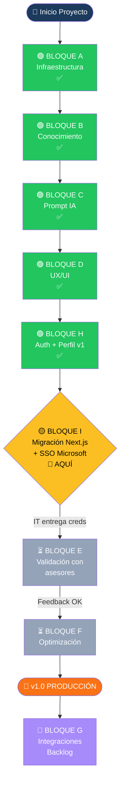

---

## 📊 Detalle por Bloque

### 🟢 BLOQUE A — Infraestructura ✅

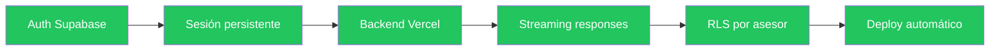

### 🟢 BLOQUE B — Conocimiento ✅

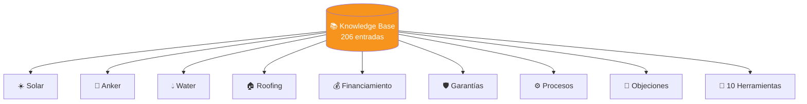

### 🟢 BLOQUE C — Prompt Adaptativo ✅

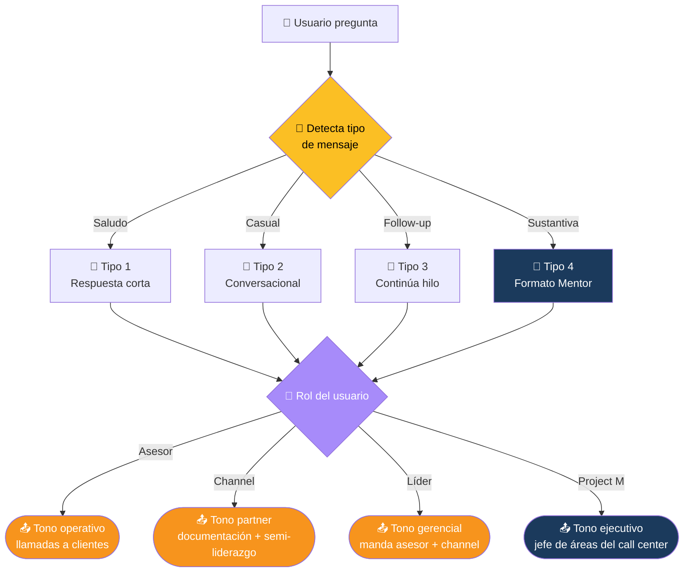

**Jerarquía del call center:**
- 📞 **Asesor** — llamadas a clientes (operativo)
- 📋 **Channel** — documentación + semi-liderazgo del grupo
- 👔 **Líder** — manda Asesor + Channel del equipo
- 🎯 **Project M** — jefe de Asesores, Channel y Líderes de todas las áreas

> 🔍 **Calidad** opera aparte: evalúan llamadas y apoyan asignación de citas. No están en la cadena de mando.

### 🟢 BLOQUE D — UX/UI ✅

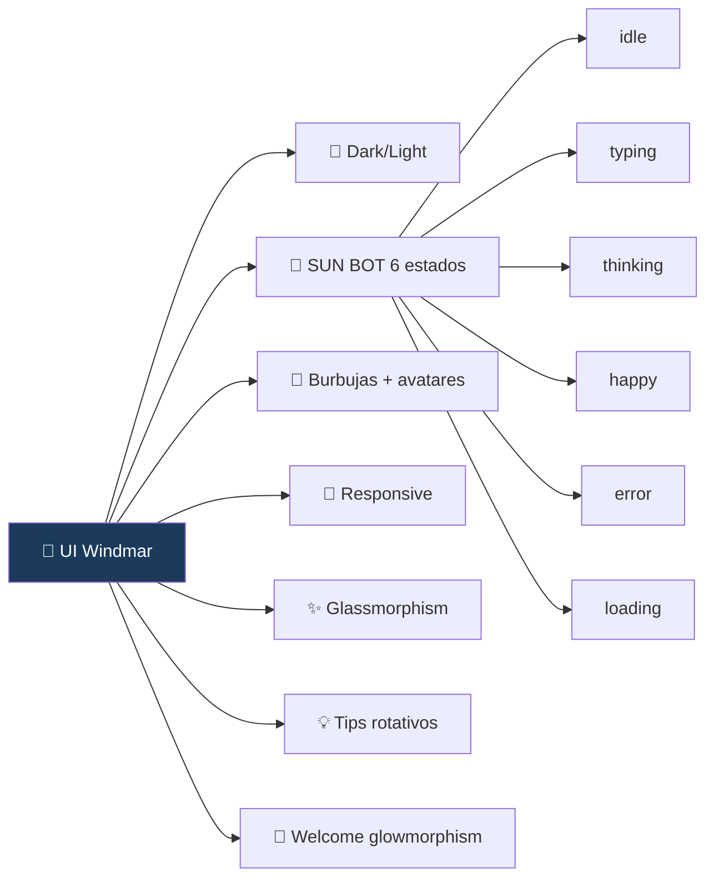

### 🟢 BLOQUE H — Auth + Perfil v1 ✅ (REEMPLAZADO por BLOQUE I)

> Sistema de email + password de Supabase Auth. Funcional pero reemplazado por SSO corporativo.

### 🟡 BLOQUE I — Migración Next.js + SSO Microsoft 📍 EN CURSO

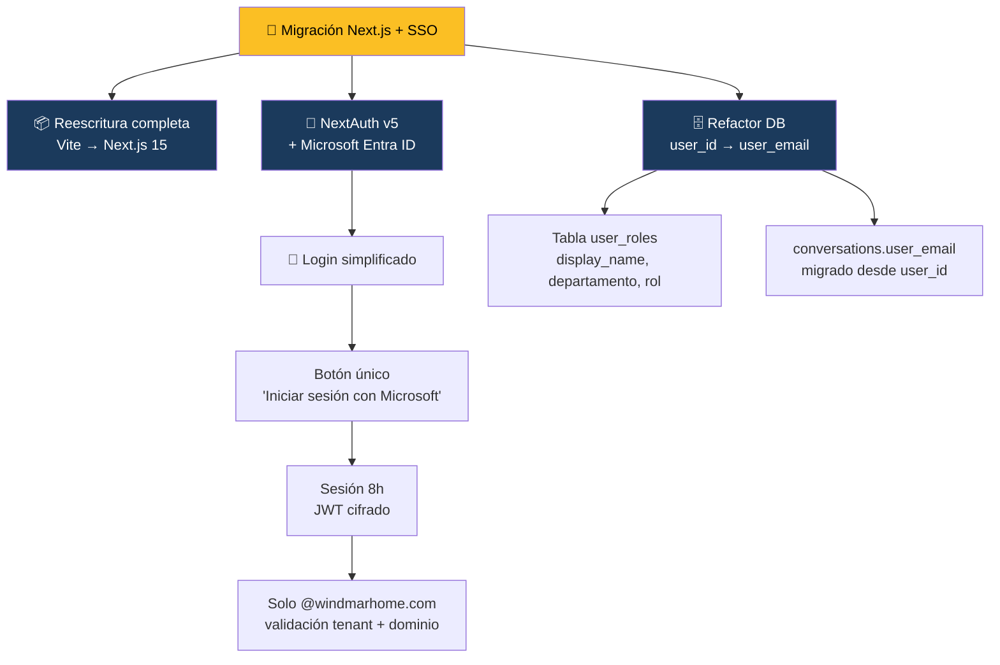

**Stack nuevo:**

| Capa | Antes (v1) | Ahora (v2) |
|---|---|---|
| Framework | React + Vite | **Next.js 15** + React 19 |
| Auth | Supabase Auth (email/password) | **NextAuth v5** + Microsoft Entra ID |
| Sesiones | Token Supabase | **JWT cifrado, 8h TTL** |
| Identidad | UUID `auth.users.id` | **Email corporativo** |
| Profile data | `auth.users.user_metadata` | Tabla `user_roles` |
| Acceso DB | Anon key + RLS | **Service role + checks en API layer** |
| Email | Resend SMTP via Supabase | **Removido** (decisión: SSO es self-explanatory) |

**Flujo SSO completo:**

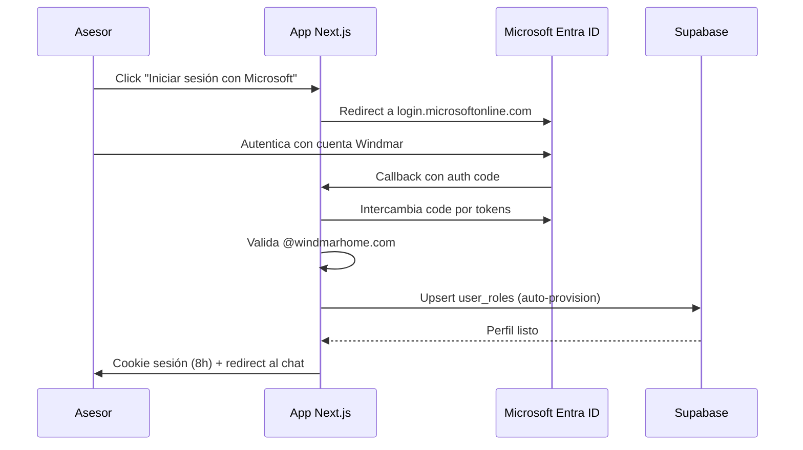

### 🟡 BLOQUE E — Validación (próximo, después de SSO)

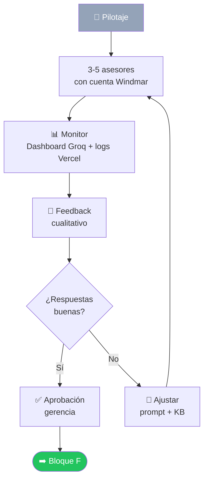

### ⏳ BLOQUE F — Optimización (próximo)

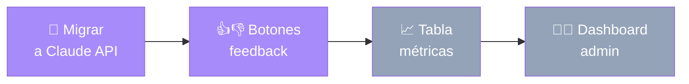

### 🔮 BLOQUE G — Integraciones Futuras

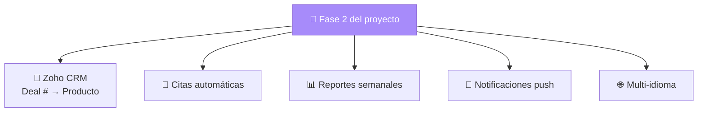

---

## 🛣️ Línea de Tiempo

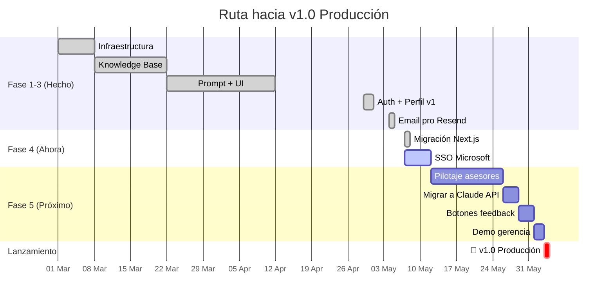

---

## 🎯 Prioridades Esta Semana

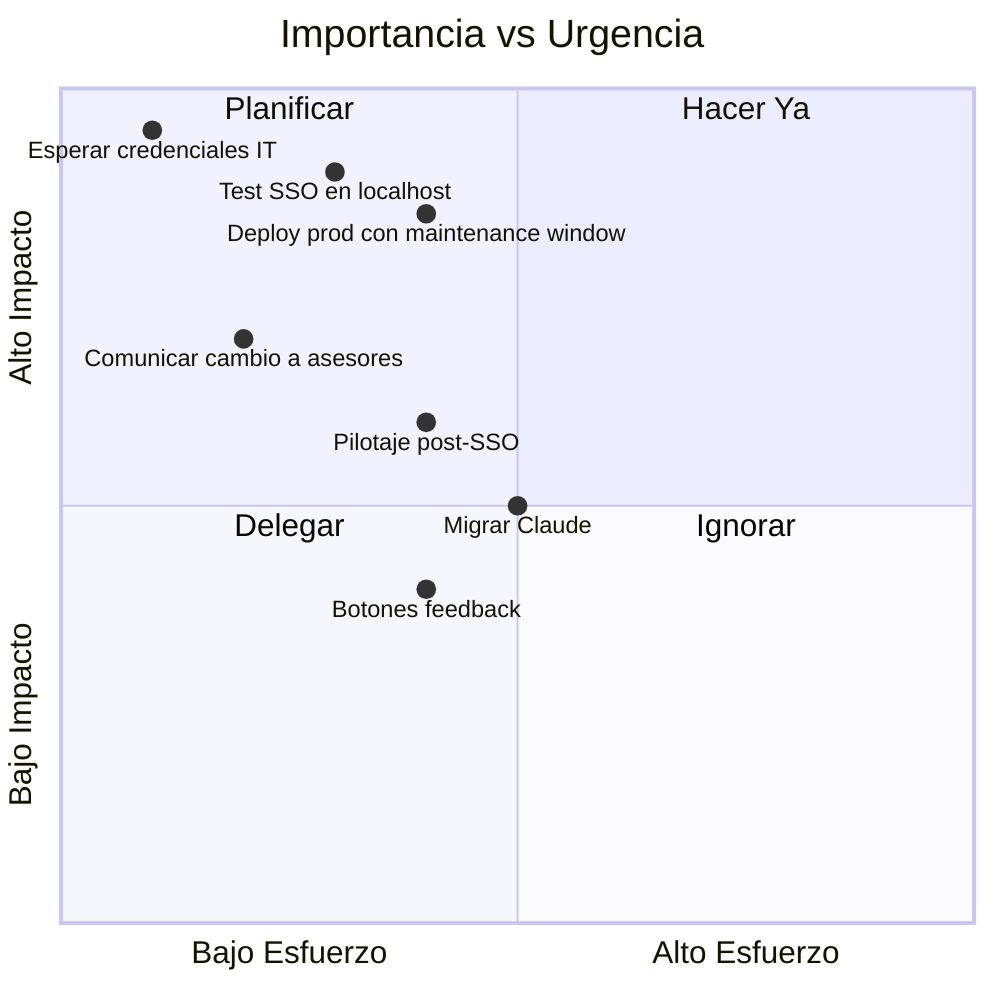

---

## 🚦 Semáforo de Riesgos

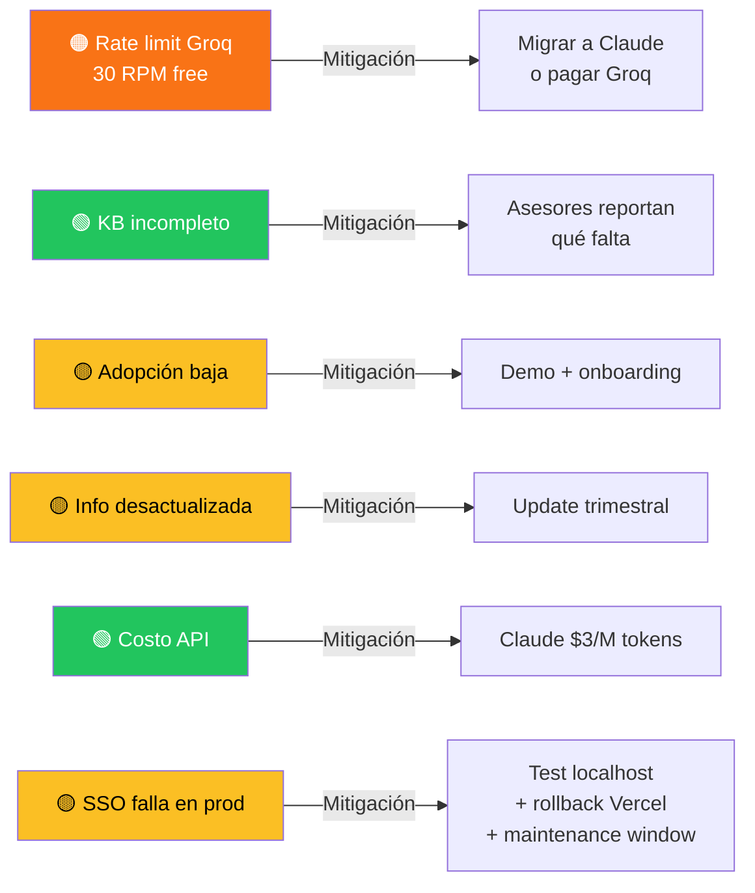

---

## 📅 Bitácora de Cambios

### 7 mayo 2026 — Migración Next.js + SSO Microsoft 🆕

**Reescritura completa Vite → Next.js 15:**
- Proyecto nuevo en paralelo: `windmar-ai-agent-next/` (44 archivos, 0 errores de build)
- App actual `WINDMAR-AI-AGENT-main/` sigue corriendo intacto en producción durante la migración
- Stack: Next.js 15 + React 19 + TypeScript + NextAuth v5
- Todos los componentes (Sidebar, ChatWindow, ChatMessage, MascotPanel, etc.) migrados con `'use client'`
- Endpoint `api/chat.ts` (Vercel function) → `app/api/chat/route.ts` (Next.js route handler con streaming)
- Nuevos endpoints: `/api/conversations`, `/api/conversations/[id]`, `/api/messages`, `/api/profile`
- SYSTEM_PROMPT extraído a `src/lib/prompts.ts` para mejor mantenimiento

**SSO Microsoft Entra ID via NextAuth v5:**
- Provider built-in `microsoft-entra-id`
- Restricción a dominio `@windmarhome.com` en callback `signIn`
- Sesión JWT cifrada de 8 horas (auto-logout al final del turno)
- Middleware protege todas las rutas (excepto `/login` y assets estáticos)
- LoginScreen rediseñado: un solo botón "Iniciar sesión con Microsoft" (logo oficial 4 cuadrados)
- Eliminados: pantalla de registro, flip card 3D, recuperar contraseña, validación de email duplicado — Microsoft maneja todo

**Refactor de identidad y base de datos:**
- Tabla nueva `user_roles` reemplaza `auth.users.user_metadata` para `display_name`, `departamento`, `rol`
- `conversations.user_id` (UUID) → `conversations.user_email` (TEXT) — backfill incluido
- Migraciones SQL: `004_user_roles.sql` + `005_conversations_email.sql`
- RLS sin políticas → solo `service_role` accede (más simple, validación a nivel API)

**Decisión: sin emails / sin DNS**
- Se descartó la verificación DNS de `windmarhome.com` en GoDaddy/Resend
- Welcome email REMOVIDO — el SSO es self-explanatory: el asesor sabe que entró cuando ve a Microsoft autenticarlo
- `resend` y dependencias eliminadas del proyecto (-18 paquetes, middleware más liviano)
- Si en el futuro se requiere email, se puede agregar Microsoft Graph API (Mail.Send) sin necesidad de DNS

**Solicitudes a IT:**
- ⏳ Client ID + Client Secret + Tenant ID del App Registration en Azure
- 📌 Redirect URI registrada: `https://windmar-ai-agent.vercel.app/api/auth/callback/microsoft-entra-id`

**Plan de despliegue:**
- Test local en `http://localhost:3000` cuando llegue creds
- Ventana de mantenimiento ~10 min para deploy a producción
- Mismo URL público `windmar-ai-agent.vercel.app` (Vercel auto-detecta cambio Vite → Next.js)
- Rollback inmediato disponible vía dashboard Vercel si falla

---

### 4 mayo 2026 — Email profesional con Resend + Reset total + IT ticket

**Reset total y rebuild:**
- Eliminados todos los usuarios, conversaciones y sesiones
- Cleanup adicional de `auth.identities` (residuales que bloqueaban signup)
- Base de datos virgen lista para pilotaje

**Email profesional via Resend SMTP:**
- Cuenta Resend creada (workspace "windmarhome")
- API key generada y guardada en Supabase SMTP Settings
- Configuración SMTP completada:
  - Host: `smtp.resend.com`
  - Port: `465`
  - Username: `resend`
  - Sender temporal: `onboarding@resend.dev`
- Plantilla HTML personalizada en Supabase con branding Windmar
- Subject: "¡Bienvenido al Agente Windmar Home! ☀️"

**Identificadas 2 limitaciones del free tier:**
- ⚠️ Sender `onboarding@resend.dev` solo permite enviar al dueño del workspace
- ⚠️ Imágenes externas bloqueadas por defecto en clientes (Gmail/Outlook)
- ✅ Solución temporal: email confirmation desactivado para fase de pilotaje

**Solicitud DNS enviada a IT (iNubo):**
- Dominio `windmarhome.com` agregado en Resend
- 3 records DNS generados (1 MX + 2 TXT para SPF/DKIM)
- Ticket creado en sistema iNubo Managed
- Estado: ⏳ Esperando respuesta de IT

**Queries SQL para Project M:**
- 5 queries listos para monitorear conversaciones de TODOS los asesores
- Resumen de actividad, mensajes por usuario, preguntas frecuentes
- Estadísticas para reportar a gerencia

---

### 🔮 PENDIENTES — Por hacer cuando IT entregue lo que falta

| # | Tarea | Cuándo | Bloqueado por |
|---|---|---|---|
| 1 | Recibir Client ID + Secret + Tenant ID de Azure | ⏳ | IT |
| 2 | Pegar 4 variables en `.env.local` y probar SSO en localhost | 1 día | Credenciales IT |
| 3 | Correr migraciones SQL `004` y `005` en Supabase | 30 min | — |
| 4 | Push a GitHub + deploy Vercel + smoke test | 1 hora | Test local OK |
| 5 | Ventana de mantenimiento + comunicar a asesores | 30 min | Deploy listo |

**Beneficios después del SSO:**
- ✅ Cero passwords que recordar — entrada con cuenta Microsoft Windmar
- ✅ Acceso restringido a nivel de tenant Azure (más seguro que validación frontend)
- ✅ Auto-logout 8h alineado al turno de trabajo
- ✅ Flujo idéntico al resto de apps Windmar (TechSupportHub etc.)
- ✅ Sin dependencia de DNS, GoDaddy ni servicios de email externos

---

### 1 mayo 2026 — Roles ampliados + Chat estilo ChatGPT + Anti-alucinación

**Roles del asesor:**
- Renombrado "Jefe" → **Líder** (terminología más actual)
- Nuevo rol **Project M** (Project Manager — jefe de líderes)
- 4 niveles de tono ahora: Asesor / Líder / Channel / Project M

**Rediseño de chat tipo ChatGPT:**
- Burbuja IA eliminada (sin fondo, sin borde, sin sombra)
- Texto IA fluye libre estilo ChatGPT
- Avatar SUN BOT mantenido al lado
- Cursor parpadeante streaming mantenido

**Reglas anti-alucinación (críticas):**
- 🔴 REGLA #0 — Lista cerrada de 10 herramientas reales
- 🔴 REGLA #1 — Solo precios literales del knowledge_base
- 🔴 REGLA #2 — Si hay duda, omite

---

### 30 abril 2026 — Auth avanzado + perfil de usuario (v1, ahora reemplazado)

**Login/Registro completamente rediseñado:**
- Tarjeta con animación 3D flip
- Cara frontal: login + recuperar contraseña
- Cara trasera: registro completo
- T&C versionado v1.0

**Sistema de perfil:**
- ProfileModal con campos editables
- Datos persisten en `user_metadata` de Supabase

**Nota:** este sistema fue reemplazado el 7 mayo por SSO Microsoft. El ProfileModal sigue vivo pero ahora escribe a la tabla `user_roles` en lugar de `user_metadata`.

---

## 📍 ¿Cómo ver este mapa?

### Opción 1 — GitHub (más fácil) ✨
1. Ya está en tu repo: `ROADMAP.md`
2. Abre el archivo en GitHub web
3. Los diagramas se renderizan **automáticamente**
4. Link directo: `https://github.com/JnSbstnRivera/WINDMAR-AI-AGENT/blob/main/ROADMAP.md`

### Opción 2 — Mermaid Live Editor
1. Ve a https://mermaid.live
2. Copia/pega cualquier bloque ` ```mermaid ` de este archivo
3. Lo ves en tiempo real, lo descargas como PNG/SVG

### Opción 3 — VS Code
1. Instala extensión "Markdown Preview Mermaid Support"
2. Abre `ROADMAP.md`
3. `Ctrl+Shift+V` para preview

---

## 🔄 Cómo actualizar este mapa

Cuando completes algo:
1. Cambia `🔄` por `✅`
2. Cambia colores `fbbf24` (amarillo) por `22c55e` (verde)
3. Mueve la flecha de "📍 ESTAMOS AQUÍ" al siguiente bloque
4. Push a GitHub → mapa actualizado para todos

---

**Última actualización**: 7 mayo 2026
**Próxima revisión sugerida**: cuando IT entregue las credenciales del App Registration de Azure
