# 🗺️ Roadmap Visual — WINDMAR AI AGENT

> Mapa conceptual del proyecto. **Última actualización: 1 mayo 2026**
> Estado: **Fase de Validación** 🔄

---

## 🌟 Vista General

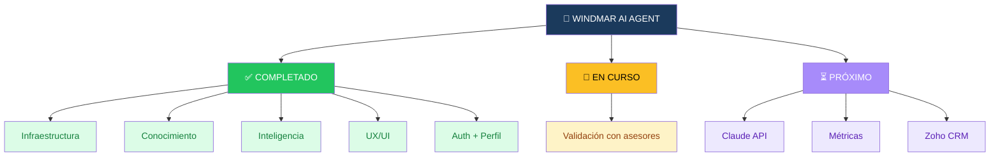

---

## 🚦 Estado por Bloques

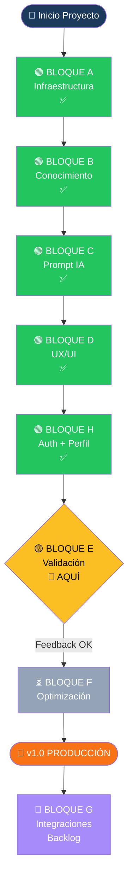

---

## 📊 Detalle por Bloque

### 🟢 BLOQUE A — Infraestructura ✅

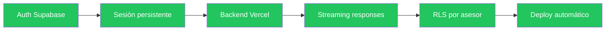

### 🟢 BLOQUE B — Conocimiento ✅

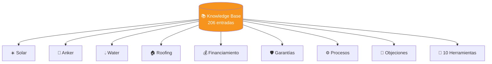

### 🟢 BLOQUE C — Prompt Adaptativo ✅

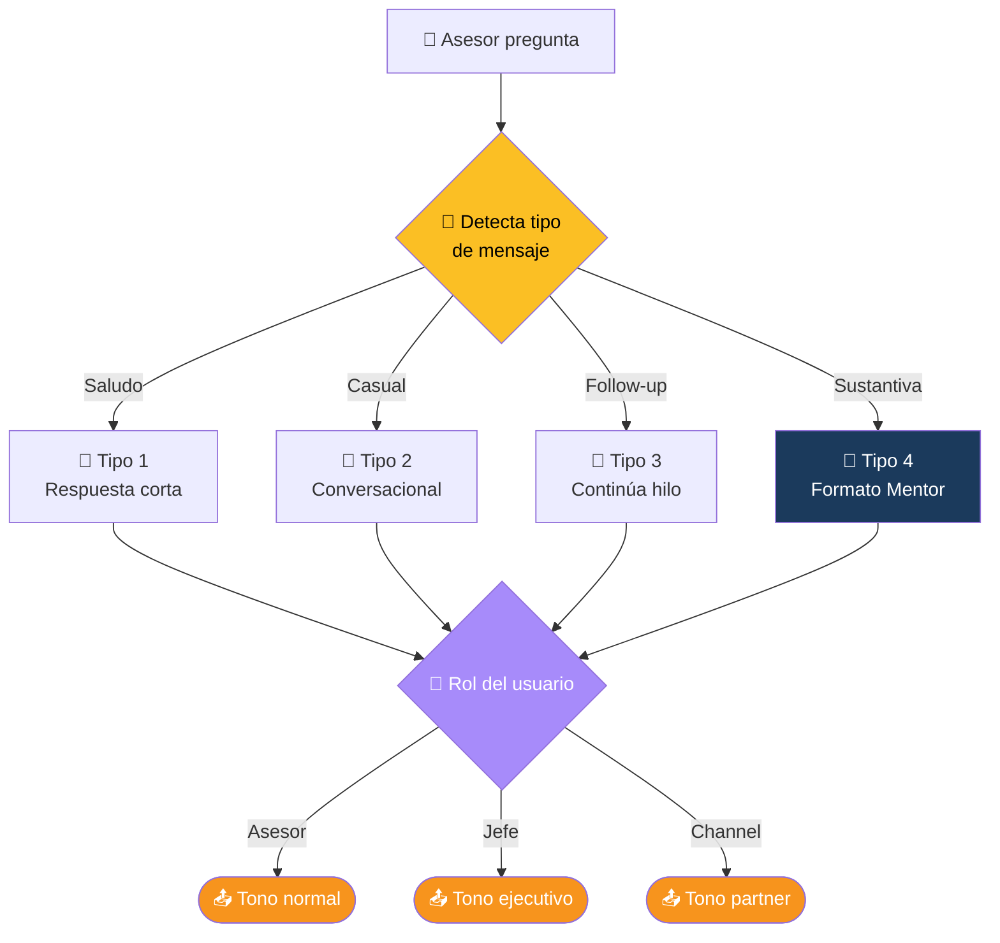

### 🟢 BLOQUE D — UX/UI ✅

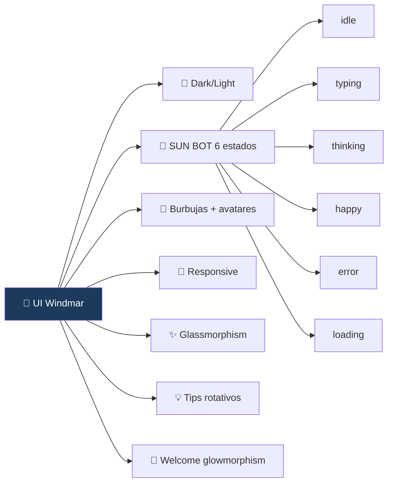

### 🟢 BLOQUE H — Auth + Perfil ✅

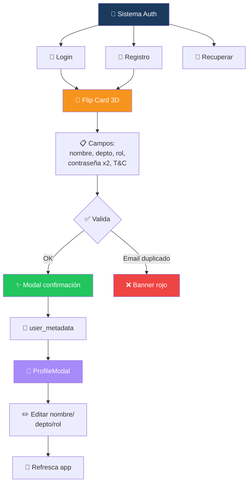

### 🟡 BLOQUE E — Validación 📍 EN CURSO

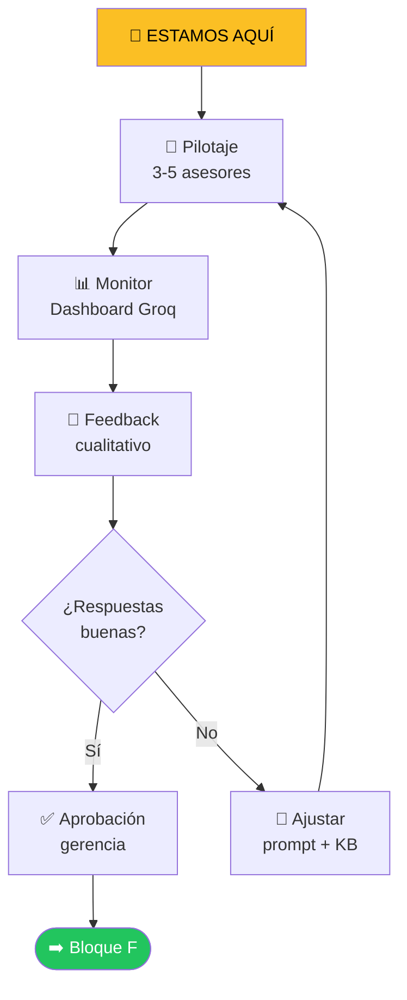

### ⏳ BLOQUE F — Optimización (próximo)


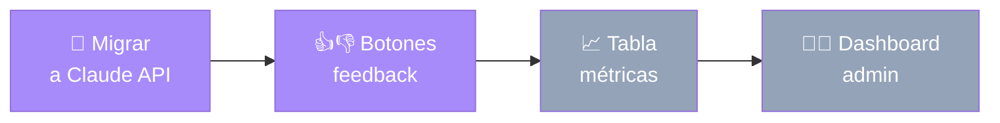

### 🔮 BLOQUE G — Integraciones Futuras

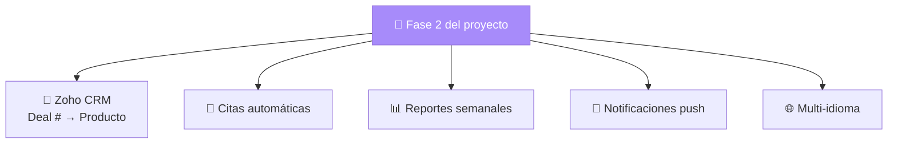

---

## 🛣️ Línea de Tiempo

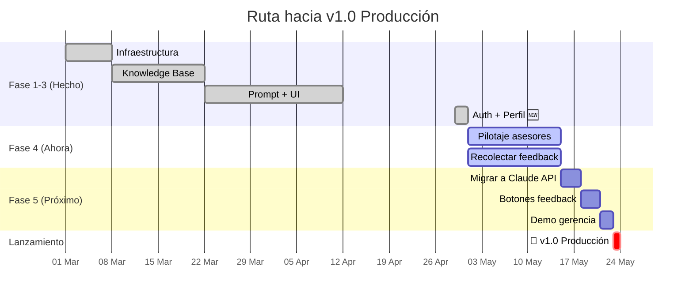

---

## 🎯 Prioridades Esta Semana

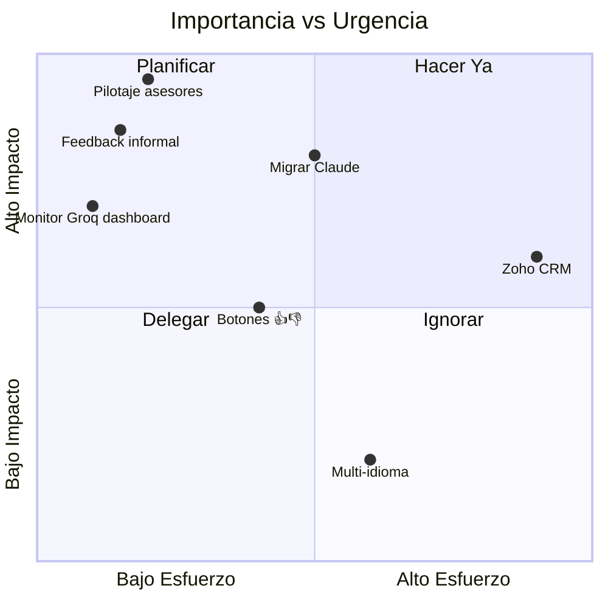

---

## 🚦 Semáforo de Riesgos

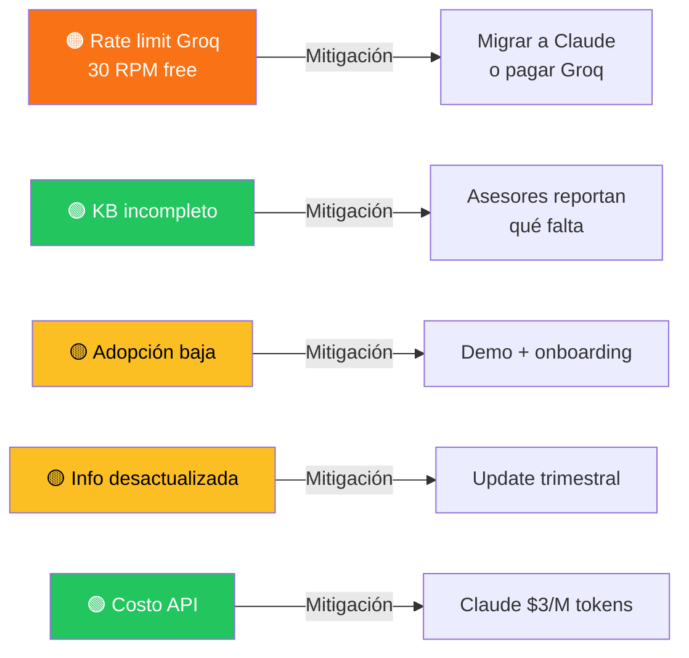

---

## 📅 Bitácora de Cambios

### 1 mayo 2026 — Roles ampliados + Chat estilo ChatGPT + Anti-alucinación 🆕

**Roles del asesor:**
- Renombrado "Jefe" → **Líder** (terminología más actual)
- Nuevo rol **Project M** (Project Manager — jefe de líderes)
- 4 niveles de tono ahora: Asesor / Líder / Channel / Project M
- Project M recibe el tono más ejecutivo: KPIs, stakeholders, visión 360, alineación con dirección

**Rediseño de chat tipo ChatGPT:**
- Burbuja IA eliminada (sin fondo, sin borde, sin sombra)
- Acento naranja vertical eliminado
- Texto IA fluye libre estilo ChatGPT
- Avatar SUN BOT mantenido al lado
- Cursor parpadeante streaming mantenido
- Botón "Copiar para WhatsApp" mantenido
- Chat ancho a max-w-3xl (estilo ChatGPT)
- Burbuja del usuario sin tocar (navy gradient derecha)
- Más respiro entre mensajes

**Reglas anti-alucinación (críticas):**
- 🔴 REGLA #0 — Lista cerrada de 10 herramientas reales. Bot NO puede inventar URLs/herramientas (ej: "Calculadora de ahorro de agua" — no existe)
- 🔴 REGLA #1 — Solo precios literales del knowledge_base. NO promos/descuentos inventados
- 🔴 REGLA #2 — Si hay duda, omite. Mejor respuesta corta sin dato que larga con dato falso

**Otros ajustes:**
- Login/Registro sin scroll en cualquier viewport (grid stacking)
- Logo decorativo welcome +80px con glow blanco
- Botón "Perfil" reemplazado por engranaje ⚙️ (look uniforme TopBar)
- launch.json eliminado (equipo corporativo, deploy via Vercel únicamente)

---

### 30 abril 2026 — Auth avanzado + perfil de usuario

**Login/Registro completamente rediseñado:**
- Tarjeta con animación 3D flip (eje Y, 0.7s premium curve)
- Cara frontal: login + "¿Olvidaste contraseña?" + logo decorativo con partículas
- Cara trasera: registro con campos completos (nombre amigable, depto, rol, contraseñas, T&C)
- Grid stacking para auto-altura sin scroll en cualquier viewport
- Detección de email duplicado con banner rojo + icono
- Modal de confirmación del nombre antes de crear cuenta
- T&C con modal expandible (versionado v1.0 — Abril 2026)
- Recuperar contraseña con email reset

**Sistema de perfil:**
- ProfileModal con campos editables (nombre, depto, rol)
- Engranaje ⚙️ en TopBar abre el modal
- Datos persisten en `user_metadata` de Supabase
- Refetch automático después de guardar

**Personalización del bot:**
- Bot saluda con `display_name` (no más "juan.s", ahora "Don Pepe")
- Sidebar muestra nombre + departamento · rol
- Tono del bot adaptado por rol:
  - **Asesor** → tono normal
  - **Jefe** → "para tu equipo...", "puedes comunicar a tus asesores..."
  - **Channel** → "para tu canal...", "tus distribuidores..."

**UI polish:**
- Welcome screen con logo grande +80px y glow blanco
- Welcome shifted hacia arriba (justify-start + pt-vh)
- Logo decorativo con brillo blanco + partículas amarillas (login + welcome)
- SUN BOT mascota reposicionado al lado del input

**Commits del día**: 12 commits, ~1,200 líneas de código nuevas/modificadas

---

## 📍 ¿Cómo ver este mapa?

### Opción 1 — GitHub (más fácil) ✨
1. Ya está en tu repo: `ROADMAP.md`
2. Abre el archivo en GitHub web
3. Los diagramas se renderizan **automáticamente**
4. Link directo: `https://github.com/JnSbstnRivera/WINDMAR-AI-AGENT/blob/main/ROADMAP.md`

### Opción 2 — Mermaid Live Editor
1. Ve a https://mermaid.live
2. Copia/pega cualquier bloque ` ```mermaid ` de este archivo
3. Lo ves en tiempo real, lo descargas como PNG/SVG

### Opción 3 — VS Code
1. Instala extensión "Markdown Preview Mermaid Support"
2. Abre `ROADMAP.md`
3. `Ctrl+Shift+V` para preview

### Opción 4 — Notion
1. Crea página nueva
2. `/code` → selecciona "mermaid"
3. Pega el bloque que quieras

---

## 🔄 Cómo actualizar este mapa

Cuando completes algo:
1. Cambia `🔄` por `✅`
2. Cambia colores `fbbf24` (amarillo) por `22c55e` (verde)
3. Mueve la flecha de "📍 ESTAMOS AQUÍ" al siguiente bloque
4. Push a GitHub → mapa actualizado para todos

---

**Última actualización**: 1 mayo 2026
**Próxima revisión sugerida**: 8 mayo 2026 (después de 1 semana de pilotaje)
