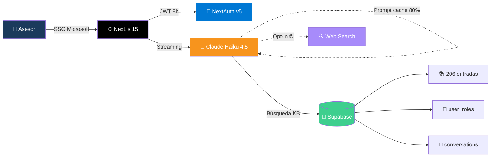
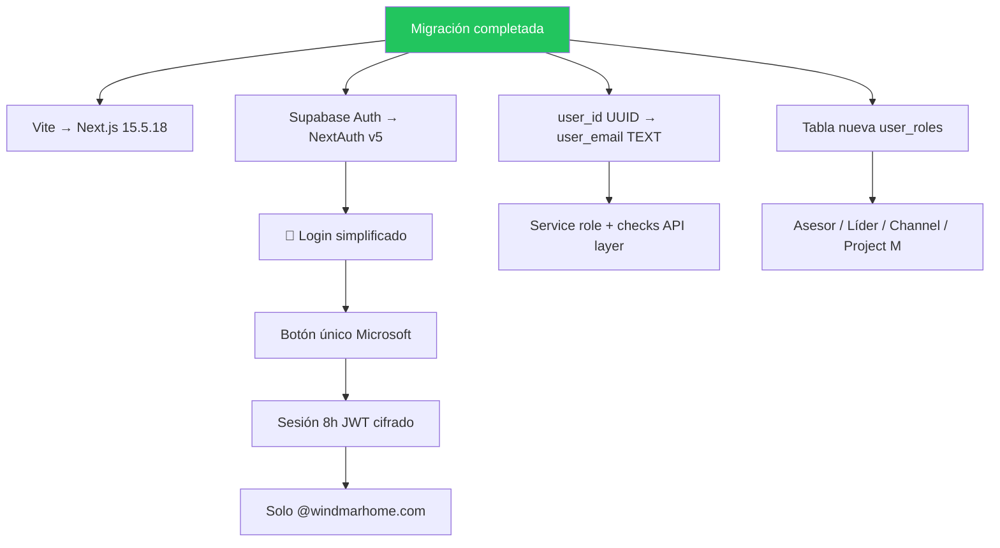
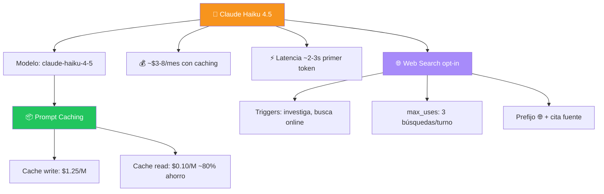
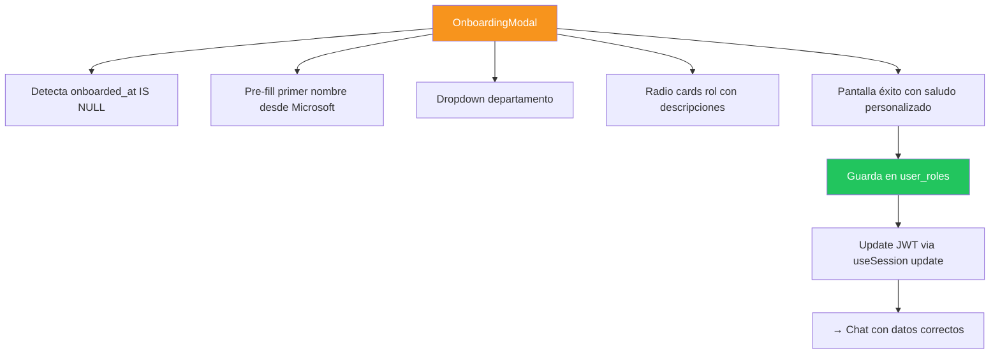
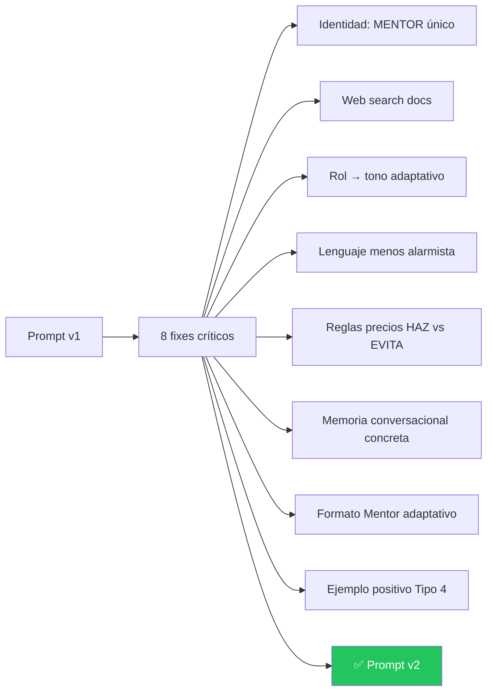
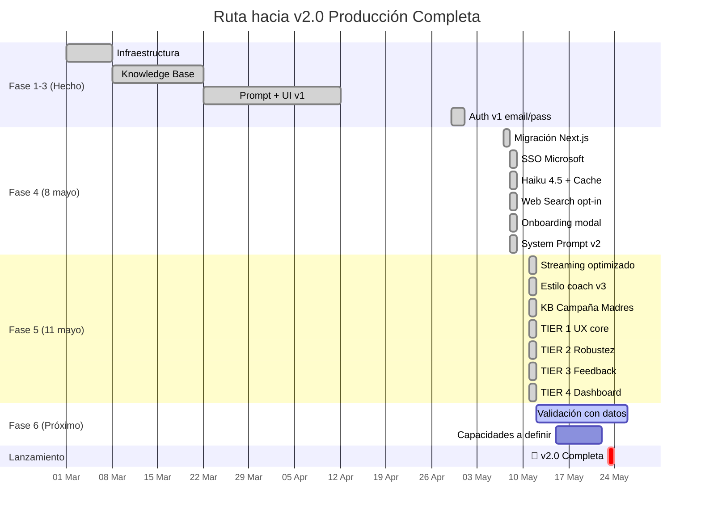
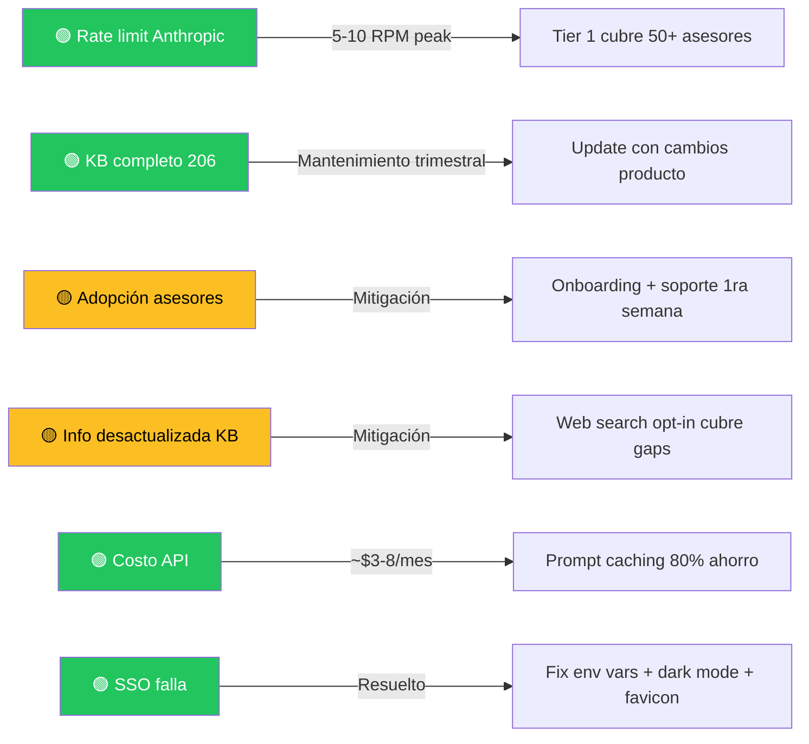

# 🗺️ Roadmap Visual — WINDMAR AI AGENT

> Mapa conceptual del proyecto. **Última actualización: 5 junio 2026 (v5)**
> Estado: **🟢 EN PRODUCCIÓN — Uso activo + Panel admin operativo + 5 admins + PWA instalable**

---

## 🌟 Vista General

```mermaid
flowchart TD
    Root[🌟 WINDMAR AI AGENT]
    Root --> Done[✅ COMPLETADO]
    Root --> Now[🔄 EN USO]
    Root --> Next[⏳ PRÓXIMO]

    Done --> D1[Infraestructura]
    Done --> D2[Knowledge Base]
    Done --> D3[Prompt Adaptativo]
    Done --> D4[UX/UI Premium]
    Done --> D5[SSO Microsoft]
    Done --> D6[Migración Next.js]
    Done --> D7[Claude Haiku 4.5]
    Done --> D8[Web Search opt-in]
    Done --> D9[Onboarding asesores]
    Done --> D10[📸 Foto perfil Microsoft]
    Done --> D11[⚡ Streaming optimizado]
    Done --> D12[📊 Dashboard admin]
    Done --> D13[👍 Feedback 👍/👎]
    Done --> D14[📝 Markdown completo]
    Done --> D15[🎨 UX Polish v2]
    Done --> D16[📲 PWA instalable]

    Now --> N1[Validación con asesores reales]
    Now --> N2[Recolección feedback en /admin]

    Next --> X1[A definir según feedback]

    style Root fill:#1B3A5C,color:#fff
    style Done fill:#22c55e,color:#fff
    style Now fill:#fbbf24,color:#000
    style Next fill:#a78bfa,color:#fff
    style D1 fill:#dcfce7,color:#15803d
    style D2 fill:#dcfce7,color:#15803d
    style D3 fill:#dcfce7,color:#15803d
    style D4 fill:#dcfce7,color:#15803d
    style D5 fill:#dcfce7,color:#15803d
    style D6 fill:#dcfce7,color:#15803d
    style D7 fill:#dcfce7,color:#15803d
    style D8 fill:#dcfce7,color:#15803d
    style D9 fill:#dcfce7,color:#15803d
    style D10 fill:#dcfce7,color:#15803d
    style D11 fill:#dcfce7,color:#15803d
    style D12 fill:#dcfce7,color:#15803d
    style D13 fill:#dcfce7,color:#15803d
    style D14 fill:#dcfce7,color:#15803d
    style D15 fill:#dcfce7,color:#15803d
    style D16 fill:#dcfce7,color:#15803d
    style N1 fill:#fef3c7,color:#92400e
    style N2 fill:#fef3c7,color:#92400e
    style X1 fill:#ede9fe,color:#5b21b6
```



---

## 🚦 Estado por Bloques

```mermaid
flowchart TD
    Start([🚀 Inicio Proyecto]) --> A
    A[🟢 BLOQUE A<br/>Infraestructura<br/>✅]
    A --> B[🟢 BLOQUE B<br/>Knowledge Base<br/>✅]
    B --> C[🟢 BLOQUE C<br/>Prompt IA v2<br/>✅]
    C --> D[🟢 BLOQUE D<br/>UX/UI<br/>✅]
    D --> H[🟢 BLOQUE H<br/>Auth v1 Email/Pass<br/>✅ Reemplazado]
    H --> I[🟢 BLOQUE I<br/>Migración Next.js<br/>+ SSO Microsoft<br/>✅]
    I --> J[🟢 BLOQUE J<br/>Haiku 4.5<br/>+ Web Search<br/>✅]
    J --> K[🟢 BLOQUE K<br/>Onboarding<br/>asesores nuevos<br/>✅]
    K --> L[🟢 BLOQUE L<br/>Polish + Dashboard<br/>11 mayo 2026<br/>✅]
    L --> E{🟡 BLOQUE E<br/>Validación con<br/>feedback real<br/>📍 AQUÍ}
    E -->|Feedback OK| F[⏳ BLOQUE F<br/>Próximas capacidades<br/>a definir]
    F --> V1([🎯 v2.0 PRODUCCIÓN COMPLETA])

    style A fill:#22c55e,color:#fff
    style B fill:#22c55e,color:#fff
    style C fill:#22c55e,color:#fff
    style D fill:#22c55e,color:#fff
    style H fill:#22c55e,color:#fff
    style I fill:#22c55e,color:#fff
    style J fill:#22c55e,color:#fff
    style K fill:#22c55e,color:#fff
    style L fill:#22c55e,color:#fff
    style E fill:#fbbf24,color:#000
    style F fill:#a78bfa,color:#fff
    style V1 fill:#f97316,color:#fff
    style Start fill:#1B3A5C,color:#fff
```



---

## 📊 Stack Actual (Producción)



---

## 📊 Detalle por Bloque

### 🟢 BLOQUE I — Migración Next.js + SSO Microsoft ✅



### 🟢 BLOQUE J — Claude Haiku 4.5 + Web Search ✅



### 🟢 BLOQUE K — Onboarding asesores nuevos ✅



### 🟢 BLOQUE C v2 — System Prompt Refactorizado ✅



### 🟢 BLOQUE L — Polish + Dashboard Admin ✅ (11 mayo 2026)

Día completo de polish + creación del panel administrativo para 4 admins.

```mermaid
flowchart TD
    Day11[11 mayo 2026]
    Day11 --> SP[SYSTEM_PROMPT v3 estilo coach]
    Day11 --> Stream[Streaming optimizado 3 capas]
    Day11 --> KB[KB +9 entradas: Campaña Madres + Powerwall compat]
    Day11 --> T1[TIER 1: UX core]
    Day11 --> T2[TIER 2: Robustez]
    Day11 --> T3[TIER 3: Feedback + Mobile]
    Day11 --> T4[TIER 4: Dashboard /admin]

    Stream --> S1[X-Accel-Buffering server]
    Stream --> S2[rAF coalescing cliente]
    Stream --> S3[useTypewriter adaptativo]

    T1 --> T1a[Skeleton + Detener + Regenerar]
    T1 --> T1b[Error Boundary global]

    T2 --> T2a[Markdown completo react-markdown]
    T2 --> T2b[Rate limit 30 msgs/min]
    T2 --> T2c[Logout 15 min inactividad]
    T2 --> T2d[RAG con boost por categoría]

    T3 --> T3a[Feedback 👍/👎 con razón]
    T3 --> T3b[Mobile UX safe areas]

    T4 --> T4a[/admin con allowlist 4 emails]
    T4 --> T4b[KPIs + 4 gráficas Recharts]
    T4 --> T4c[Top palabras + hora pico]
    T4 --> T4d[Comparativa semanal]
    T4 --> T4e[Conversaciones colapsable]

    style Day11 fill:#1B3A5C,color:#fff
    style T4 fill:#F7941D,color:#fff
```

---

## 🛣️ Línea de Tiempo



---

## 🎯 Capacidades Disponibles AHORA

### 👥 Para el ASESOR (chat principal)

| Capacidad | Estado | Notas |
|---|---|---|
| 💬 Chat streaming fluido | ✅ Live | Haiku 4.5 + anti-buffering + rAF + typewriter adaptativo |
| 🔐 SSO Microsoft Entra ID | ✅ Live | NextAuth v5, JWT 8h |
| 👋 Onboarding nuevo asesor | ✅ Live | Auto-extract primer nombre |
| 🧠 Memoria conversacional | ✅ Live | Mantiene hilo dentro de sesión |
| 📚 Knowledge base oficial | ✅ Live | **215 entradas** (+ Campaña Madres + Powerwall compat) |
| 🌐 Web search | ✅ Live | Opt-in con palabras clave |
| 🔧 Tool selection | ✅ Live | 10 cotizadores oficiales |
| 🤖 Mascot SUN BOT | ✅ Live | 6 estados animados |
| 🌙 Dark mode | ✅ Live | Default + toggle |
| 📸 Foto perfil Microsoft | ✅ Live | Sidebar + avatar mensajes (estilo Teams) |
| 📝 Markdown completo | ✅ Live | Listas, tablas, code blocks, blockquotes (react-markdown) |
| 💀 Loading skeleton | ✅ Live | 3 dots animados antes del primer token |
| ⏹ Botón detener generación | ✅ Live | AbortController.signal |
| 🔄 Botón regenerar respuesta | ✅ Live | Borra y vuelve a generar |
| 👍 Feedback 👍/👎 por mensaje | ✅ Live | Con razón opcional para downvotes |
| 🛡️ Error Boundary global | ✅ Live | No más pantallas blancas |
| 🚦 Rate limit 30 msgs/min | ✅ Live | Protege TPM compartido |
| ⏱️ Logout por inactividad | ✅ Live | 15 min sin actividad + warning 1 min antes |
| 📱 Mobile UX optimizado | ✅ Live | Safe areas iPhone + auto-scroll al focus |
| 📲 PWA instalable | ✅ Live | Manifest + service worker · instalable en Windows/iOS con icono SUN BOT, ventana propia |

### 📊 Para el ADMIN (panel /admin)

| Capacidad | Estado | Notas |
|---|---|---|
| 🔒 Allowlist por email | ✅ Live | 5 admins: juan.s, a.rengifo, jesus.castro, d.buitrago, d.riano |
| 📊 4 KPIs principales | ✅ Live | Mensajes, Asesores activos, Convs, Satisfacción |
| 📈 Gráfica uso 7 días | ✅ Live | Line chart Recharts |
| 🎯 Donut 👍 vs 👎 | ✅ Live | Con porcentaje central |
| 📈 Comparativa semanal | ✅ Live | Esta vs anterior, flechas ↑↓ % cambio |
| 🏢 Uso por departamento | ✅ Live | Bar chart con paleta brand |
| 🕐 Hora pico de uso | ✅ Live | 24h en hora local PR (UTC-4) |
| 🔥 Top palabras buscadas | ✅ Live | Tag cloud, stop words ES |
| 🏆 Top asesores activos | ✅ Live | Top 10 con depto/rol |
| ⚠️ Downvotes para revisar | ✅ Live | Con razón del asesor |
| 💬 Conversaciones recientes | ✅ Live | Tabla colapsable + buscador (lupa) + modal con mensajes |
| 🔄 Auto-refresh 60s | ✅ Live | + botón refresh manual + indicador "live" |
| 🎨 Visual ejecutivo | ✅ Live | Sticky filters, SUN BOT en header, distinto del chat |

---

## 🎯 Próximas Capacidades

> 📌 **Espacio reservado para definir en próximas sesiones.**
>
> Las próximas capacidades se irán definiendo con base en:
> - Feedback real de los asesores recopilado desde `/admin` (👍/👎, comentarios)
> - Feedback de los admins durante el uso del dashboard
> - Necesidades operativas que surjan en la semana
> - Decisiones del Project Manager según prioridades del negocio
>
> **Restricción permanente**: cualquier capacidad nueva NO debe estimar
> precios. El bot solo da información — para números reales, dirige al
> cotizador correspondiente.

### 🚀 Para asesores (chat principal)

_Pendiente de definir._

### 📊 Para admins (dashboard)

_Pendiente de definir._

---

## 🚦 Semáforo de Riesgos



---

## 📅 Bitácora de Cambios

### 5 junio 2026 — PWA instalable (SUN BOT como app) 📲

Se formalizó el agente como **PWA (Progressive Web App)** para que los asesores
lo instalen como aplicación nativa en Windows (y iOS), con el icono del **SUN BOT
feliz** en escritorio y barra de tareas, abriendo en ventana propia sin barra del
navegador.

**Cambios:**
- `src/app/manifest.ts`: Web App Manifest tipado de Next.js (`display: standalone`,
  branding Windmar navy `#1B3A5C`, `short_name: SUN BOT`). Servido en
  `/manifest.webmanifest`
- **Iconos PWA** generados con `sharp` desde `sunbot-feliz.png` sobre fondo navy:
  `icon-192`, `icon-512`, `icon-maskable-512` (safe-zone 60% para el recorte
  circular de Windows/Android) y `apple-touch-icon` 180px (el `icon.png` original
  586×589 no era válido para iOS)
- `public/sw.js`: service worker (network-first en navegación, cache-first en
  estáticos, fallback offline). **No intercepta** `/api`, `/auth` ni métodos
  no-GET → next-auth y el chat intactos
- `ServiceWorkerRegister.tsx`: registro del SW solo en producción
- `layout.tsx`: metadata `manifest` + `appleWebApp` + `apple-touch-icon`
- 🐛 **Fix clave**: el middleware de next-auth redirigía `/manifest.webmanifest`
  y `/sw.js` a `/login` (307), así que el navegador no podía leer el manifest y
  **no ofrecía instalar**. Ambos añadidos a la exclusión del matcher → ahora
  responden 200 en producción

**Verificado en producción:** manifest 200 `application/manifest+json`, sw.js 200
`application/javascript`, iconos 200. Listo para instalar desde Edge/Chrome.

### 11 mayo 2026 — Día de polish + Dashboard admin 📊

Marathón completo de **17 commits** transformando la app de "MVP funcional" a "producto empresarial con telemetría".

**Mañana — Calidad de respuestas:**
- Formato fluido del prompt: prohibir `---` separadores y headers gigantes con emoji
- Estilo coach socrático (preguntar antes de responder largo, una idea a la vez, terminar con siguiente paso)
- KB +9 entradas: **Campaña Madres 2026** completa (8 entradas con vigencia 7-14 mayo, reglas showroom, descuentos por producto/financiamiento) + **Compatibilidad Powerwall 2 vs 3** (entrada crítica anti-info-incorrecta)
- 4 actualizaciones a entradas existentes de Powerwall con nota de incompatibilidad
- SYSTEM_PROMPT v3 con nueva sección PROMOCION_VIGENTE y reglas para compatibilidad PW
- `max_tokens`: 2048 → 1024 (mejora velocidad percibida sin perder calidad)

**Tarde 1 — Streaming optimizado (3 capas):**
- **Server**: Headers anti-buffering (`X-Accel-Buffering: no`, `Cache-Control: no-transform`, `Transfer-Encoding: chunked`) para evitar que Vercel/CDN bufferreen chunks pequeños
- **Cliente**: `requestAnimationFrame` coalescing — antes ~15 setState/seg con árbol pesado, ahora máximo 60fps con cada update mucho más liviano
- **UX**: Nuevo hook `useTypewriter` con velocidad adaptativa (120/240/480/1200 cps según buffer). Resultado: streaming visualmente fluido aunque Anthropic mande chunks irregulares
- Logs de TTFT, throughput y max_gap para diagnóstico futuro
- Decisión informada: mantener Haiku (no volver a Groq) — el razonamiento + anti-alucinación vale los pocos segundos extra

**Tarde 2 — TIER 1 (UX core, ~1h):**
- 💀 **Loading skeleton**: 3 dots naranjas animados antes del primer token (resuelve "vacío" de 300-500ms TTFT)
- ⏹ **Botón detener generación**: AbortController.signal en el fetch, handling gracioso del AbortError con nota "(detenido por el asesor)"
- 🔄 **Botón regenerar**: borra última respuesta del asistente (local + DB) y re-envía mismo prompt. Endpoint `DELETE /api/messages?conversation_id=X&role=assistant`
- 🛡 **ErrorBoundary global**: class component envolviendo toda la app, UI amigable con SUN BOT triste + botón "Recargar" si algo rompe
- ChatMessage memoizado con custom comparator
- ChatWindow con scroll `auto` throttled 100ms

**Tarde 3 — TIER 2 (robustez, ~2h):**
- 📝 **Markdown completo** con `react-markdown` + `remark-gfm`: listas, tablas, code blocks, blockquotes — estilos custom Tailwind con brand Windmar
- 🚦 **Rate limit 30 msgs/min/usuario** vía SELECT COUNT en messages JOIN conversations último minuto. Return 429 con `retryAfterSeconds`
- ⏱ **Auto-logout 15 min inactividad**: nuevo hook `useInactivityLogout` escucha mouse/keyboard/scroll/touch, warning amber 1 min antes
- 🔍 **RAG mejorado**: 8 → 12 candidatos por query + re-rank con boost por intención (PROMOCION_VIGENTE x1.5, FINANCIAMIENTO x1.3, etc.), top 8 finales al prompt
- 🎯 **TEST_CASES.md**: 10 prompts representativos con respuesta esperada para validación manual

**Tarde 4 — TIER 3 (feedback + mobile, ~1h):**
- 👍 **Sistema feedback 👍/👎**: nueva tabla `message_feedback` + endpoint `/api/feedback` + UI con thumbs en cada respuesta IA. Downvote ofrece textarea opcional para razón
- 📱 **Mobile UX**: `viewport-fit=cover` para safe areas iPhone notch + clase `.safe-bottom` con `env(safe-area-inset-bottom)` + auto-scroll al focus en mobile (<768px) + soporte 100dvh
- ✨ **Fade-in animation** en mensajes nuevos (300ms con keyframe `wmFadeInUp`)
- Theme color `#1B3A5C` (navy brand) en barra del navegador

**Tarde 5 — TIER 4 (Dashboard admin, ~4h):**

Construcción del panel administrativo completo en `/admin`:

- 🔒 **Seguridad allowlist 3 capas**: middleware (sesión) + layout server-side (validación email) + endpoint API (doble check). Inmune a cambios de perfil del usuario
- 👥 **4 admins hardcoded + env var**: juan.s, a.rengifo, jesus.castro, d.buitrago. `ADMIN_EMAILS` extensible
- 🎨 **Visual ejecutivo distinto al chat**: header navy oscuro, sin sidebar/mascot, tipografía densa, SUN BOT en header con halo brand
- 📊 **9 funciones SQL** para métricas: KPIs, uso por día, top asesores, downvotes, conversaciones, departamentos, keywords, comparativa semanal, hora pico
- 📈 **Recharts 3.8.1** para gráficas: line chart, donut, bar charts
- 🎯 **TIER A — narrativa de presentación**: comparativa semanal con flechas ↑↓, gráfica por departamento, top palabras buscadas (tag cloud con stop words ES), hora pico de uso (24h)
- 💬 **Vista de conversaciones**: tabla colapsable + buscador con lupa (filtra nombre/email/depto/título) + modal con detalle de mensajes
- 🔄 **Auto-refresh 60s** + botón manual + indicador "live" pulsante
- 📌 **Toolbar sticky** al hacer scroll, filtros siempre visibles
- 🏠 Default = "Todo" para mostrar panorama histórico al abrir

**Stack final acumulado:**
- Frontend: Next.js 15.5.18 + React 19 + Tailwind v4 + Recharts + react-markdown
- Backend: NextAuth v5 + Microsoft Entra ID + Anthropic SDK + Supabase
- DB: PostgreSQL 17 con 13 funciones SQL custom y 215 entradas KB
- Hosting: Vercel — 1 deploy unificado con admin protegido

**Tarde 6 — Ajustes finos del Dashboard + Soft Delete + Bug fix routing:**

Tras compartir el dashboard con los primeros admins reales, se hicieron ajustes
quirúrgicos basados en feedback directo y se cazaron bugs críticos del bot.

🎨 **Dashboard tuning** (basado en feedback de uso real):
- Default cambiado de "Hoy" → "Todo" para mostrar panorama histórico al abrir
- Toolbar de filtros ahora STICKY con backdrop blur — siempre visible al hacer scroll
- Indicador "live" verde pulsante al lado de la hora de última actualización
- Removidas dos secciones por preferencia del admin: "Top palabras buscadas" y
  "Esta semana vs anterior" (archivos y SQL conservados, fácil reactivar)
- Vista de conversaciones colapsable con chevron animado
- Buscador con lupa: filtra nombre/email/departamento/título en tiempo real
- Badge con conteo dinámico "X de Y" cuando hay filtro activo
- SUN BOT con halo brand en el header del dashboard (era SVG genérico)

👥 **Admins expandidos** (5 totales, antes 1):
- Refactor de `admin-auth.ts`: HARDCODED_ADMINS array que SE SUMA con env var
  `ADMIN_EMAILS` (antes era fallback excluyente — más robusto)
- Lista: juan.s, a.rengifo, jesus.castro, d.buitrago, d.riano

🛡️ **Soft Delete de conversaciones** (problema crítico de auditoría):
- Antes: si un asesor borraba sus chats, se perdían PERMANENTEMENTE — métricas
  del dashboard se afectaban, feedback 👍/👎 se borraba, no había auditoría
- Ahora: `ALTER TABLE conversations ADD COLUMN deleted_at TIMESTAMPTZ`
- Endpoints DELETE → UPDATE con timestamp (no eliminan físicamente)
- Chat del asesor filtra `WHERE deleted_at IS NULL` — no nota la diferencia
- Dashboard admin MUESTRA TODO con badge `🗑 Eliminada` + tooltip con fecha exacta
- Reversible: `UPDATE conversations SET deleted_at = NULL` restaura
- `admin_recent_conversations` recreada con campos is_deleted + deleted_at

🐛 **Bug crítico fix — Routing Roofing → Loan:**
- Caso real detectado: en conversación de Roofing, el bot recomendaba Cotizador
  Loan cuando el asesor preguntaba por "financiamiento" o "mensualidades"
- Causa: `buildToolsContext()` solo leía el último mensaje, no el contexto
- **Fix 1 (código)**: nueva función `detectTopic(message, history)` analiza
  últimos 6 turnos. Si topic = "roofing" → EXCLUYE Cotizador Loan y Lease
  automáticamente, prioriza Roofing Pro. Inyecta `[TÓPICO DETECTADO: ROOFING]`
- **Fix 2 (prompt)**: SYSTEM_PROMPT v3.1 con sección "REGLAS DE ENRUTAMIENTO
  CRÍTICAS" — 6 reglas explícitas (Loan/Lease = solo Solar)
- **Fix 3 (KB)**: nueva entrada "Qué cotizador usar para cada producto — Guía
  CRÍTICA anti-confusión" con mapping producto→cotizador

📚 **Knowledge Base enriquecida** (de 215 → **217 entradas**):
- "Roofing con placas solares ya instaladas — Retiro + reinstalación SIN COSTO
  adicional" (entrada #216): aclara que cuando un cliente con placas existentes
  hace Roofing, todo el proceso está incluido en la cotización
- "Qué cotizador usar para cada producto — Guía CRÍTICA anti-confusión"
  (entrada #217): mapping completo producto → cotizador correcto

**Total del día: 21 commits, ~14 archivos nuevos, ~3,800 líneas de código, 13
funciones SQL custom, 217 entradas KB, 5 admins en producción.**

---

### 8 mayo 2026 — Día de lanzamiento definitivo 🎉

**Mañana — SSO Microsoft Entra ID:**
- Migración completa de React + Vite → Next.js 15.5.18 + NextAuth v5
- Reemplazado login email/password por botón único "Iniciar sesión con Microsoft"
- Restricción a dominio `@windmarhome.com` en callback `signIn`
- Sesión JWT cifrada de 8 horas (auto-logout al final del turno)
- Middleware protege todas las rutas (excepto `/login` y assets)
- Refactor DB: `user_roles` table reemplaza `auth.users.user_metadata`
- Fix env vars con valores vacíos (re-creación via REST API directa)
- Dark mode por defecto en login + script anti-flash SSR
- Favicon SUN BOT via Next.js convention `app/icon.png`
- Open Graph para preview en Teams/WhatsApp/Slack

**Tarde — Claude Haiku 4.5 + Web Search:**
- Migración endpoint `/api/chat` de Groq → Anthropic SDK
- Modelo: `claude-haiku-4-5` con prompt caching del SYSTEM_PROMPT (~80% ahorro)
- Web search opt-in: triggers "investiga", "busca online", "actualízame"
- Tool `web_search_20250305` con `max_uses: 3` por turno
- Prefijo 🌐 + cita de fuente cuando usa web search
- Manejo de errores tipados (RateLimitError, AuthenticationError, etc.)
- Fix bug perfil no guardaba: `useSession().update()` con datos directos al JWT
- Página de login en dark mode

**Tarde-Noche — Onboarding + Prompt v2:**
- Migración SQL 006: agrega columna `onboarded_at` a `user_roles`
- `OnboardingModal.tsx`: pantalla de bienvenida con SUN BOT, primer nombre auto-extracted, dropdown depto, radio cards rol con descripciones
- Auth signIn callback ahora extrae solo PRIMER nombre por defecto
- Endpoint POST `/api/profile/onboarding` marca `onboarded_at` + guarda perfil
- `OnboardingGate` envuelve ChatApp; modal solo si `onboarded_at IS NULL`
- Pantalla de éxito con saludo personalizado antes del primer chat
- **SYSTEM_PROMPT v2 con 8 fixes críticos:**
  - Identidad unificada como MENTOR (no mezcla Asistente)
  - Instrucciones explícitas para web search (cuándo, cómo citar)
  - Datos del asesor documentados → tono adaptativo según rol
  - Lenguaje menos alarmista (Haiku 4.5 sigue instrucciones literalmente)
  - Reglas de precios con balance HAZ vs EVITA
  - Memoria conversacional con pasos concretos
  - Formato Mentor adaptativo (no rígido) — solo secciones que aplican
  - Ejemplo positivo de buena respuesta Tipo 4

**Noche — Reset definitivo y comunicación:**
- Reset DB total para arranque limpio (KB intacto: 206)
- Anuncio a asesores para uso definitivo
- ROADMAP actualizado en GitHub

**Tarde-Noche extra — Foto de perfil Microsoft 📸:**
- Migración SQL 007: añade columna `photo_url TEXT` a `user_roles`
- Provider NextAuth Entra ID con scope explícito `User.Read`
- `auth.ts` callback `signIn` ahora descarga foto via Microsoft Graph
  (`GET /v1.0/me/photo/$value`) usando `account.access_token`
- Foto base64 (~10-50 KB) guardada en `user_roles.photo_url`, refresh en cada login
- Fallback automático a inicial mayúscula con halo brand si Graph devuelve 404
- Nuevo componente `UserAvatar.tsx` reutilizable (foto o inicial, configurable)
- Sidebar muestra avatar circular en bloque "Bienvenido, ..."
- ChatMessage muestra avatar al lado de cada mensaje del asesor (estilo Teams)
- JWT y session callbacks propagan `photoUrl` para uso en cliente

**Stack final en producción:**
- Frontend: Next.js 15.5.18 + React 19 + TypeScript + Tailwind v4
- Auth: NextAuth v5 + Microsoft Entra ID (claude-opus-4-7 SDK pattern)
- AI: Anthropic SDK + Claude Haiku 4.5 + prompt caching + web_search_20250305
- DB: Supabase PostgreSQL 17 + RLS + service_role key
- Hosting: Vercel (auto-deploy from GitHub `main`)
- URL: https://windmar-ai-agent.vercel.app

---

### 7 mayo 2026 — Decisión estratégica: SSO sin DNS

- Removido Resend SMTP y dependencia de DNS GoDaddy
- Decisión: SSO Microsoft es self-explanatory, no requiere welcome email
- Reset total de la DB (preparativo para rebuild)
- Plan de migración a Next.js + NextAuth definido

### 4 mayo 2026 — Email profesional con Resend (luego removido)

Email profesional via Resend SMTP configurado, luego descartado el 7 mayo cuando se decidió ir directamente a SSO sin DNS.

### 1 mayo 2026 — Roles ampliados + Anti-alucinación

- Agregado rol Project M (jefe de líderes)
- 4 niveles de tono: Asesor / Líder / Channel / Project M
- Reglas anti-alucinación REGLA #0/1/2 (luego refinadas en v2 del prompt)
- Chat estilo ChatGPT (sin burbujas IA)

### 30 abril 2026 — Auth v1 (luego reemplazado por SSO)

Sistema de login email/password con flip card 3D, registro con depto/rol/T&C, ProfileModal. Reemplazado completamente el 8 mayo por SSO Microsoft.

---

## 🔮 PENDIENTES — Roadmap futuro

### 🟠 Esta semana (validación post-lanzamiento)
| # | Tarea | Tiempo |
|---|---|---|
| 1 | Asesores prueban en uso real | 5-7 días |
| 2 | Recolección feedback cualitativo | continua |
| 3 | Monitor logs Vercel para errores | continua |
| 4 | Métricas Anthropic (cache hit rate, RPM) | continua |

### 🟡 Próxima semana (capacidades avanzadas)
| # | Capacidad | Esfuerzo |
|---|---|---|
| 1 | 📸 Vision: subir factura LUMA | 1h dev |
| 2 | 📊 Code execution: gráficos ROI | 1h dev |
| 3 | 🗺️ Maps/direcciones via web search | 30min dev |

### 🟢 Mes próximo (integraciones)
| # | Capacidad | Esfuerzo |
|---|---|---|
| 1 | 🔌 Integración Zoho CRM | 3h dev |
| 2 | 📊 Dashboard métricas Project M | 1d dev |
| 3 | 👍👎 Sistema feedback de respuestas | 4h dev |
| 4 | 📄 PDF processing (contratos) | 30min dev |

### 🔮 Backlog (cuando haya bandwidth)
- Foto de perfil desde Microsoft Graph
- Renombrar conversaciones
- Multi-idioma (futuro lejano)
- Notificaciones push (la base PWA ya está lista — solo falta backend de push)
- Reportes semanales automatizados

---

## 📍 ¿Cómo ver este mapa?

### Opción 1 — GitHub (más fácil)
1. Ya está en tu repo: `ROADMAP.md`
2. Abre el archivo en GitHub web
3. Los diagramas se renderizan **automáticamente**
4. Link directo: https://github.com/JnSbstnRivera/WINDMAR-AI-AGENT/blob/main/ROADMAP.md

### Opción 2 — Mermaid Live Editor
1. Ve a https://mermaid.live
2. Copia/pega cualquier bloque ` ```mermaid ` de este archivo
3. Lo ves en tiempo real, lo descargas como PNG/SVG

### Opción 3 — VS Code
1. Instala extensión "Markdown Preview Mermaid Support"
2. Abre `ROADMAP.md`
3. `Ctrl+Shift+V` para preview

---

**Última actualización**: 5 junio 2026 — PWA instalable (SUN BOT como app)
**Próxima revisión sugerida**: después de 1 semana de uso real, basado en feedback de asesores
