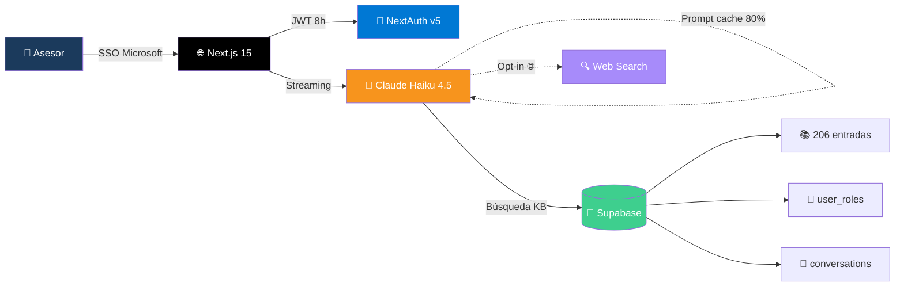
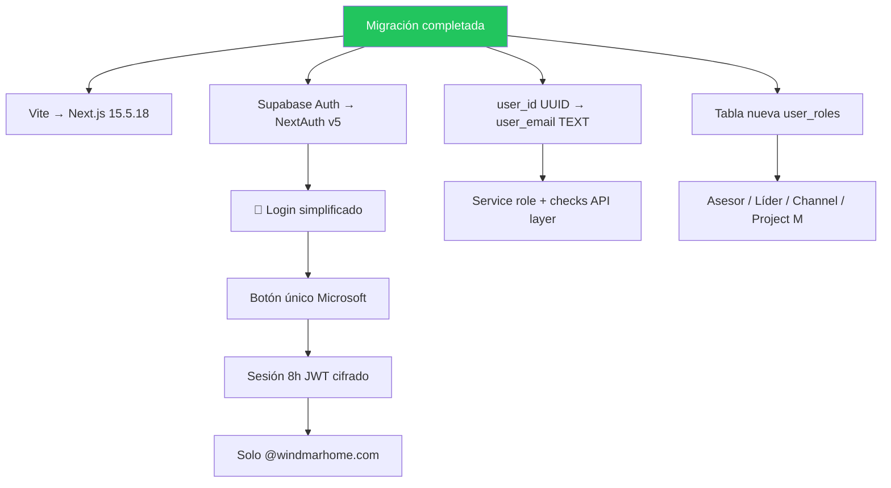
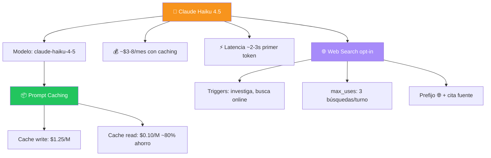
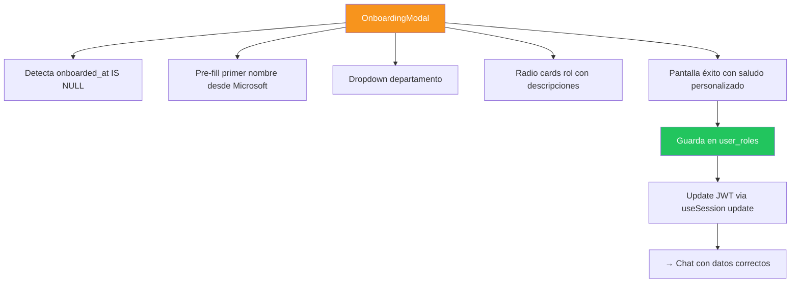
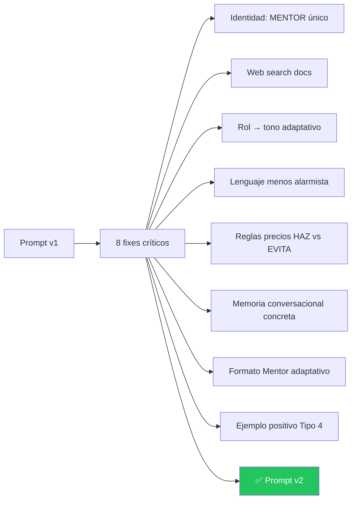
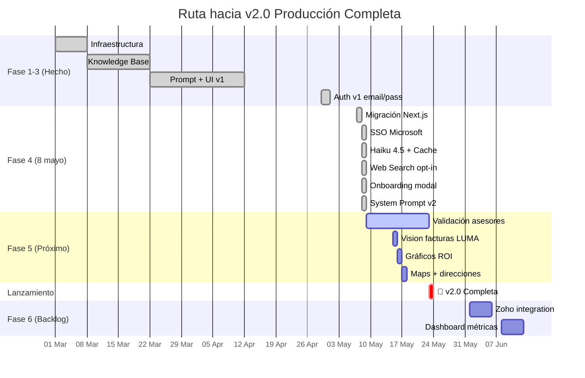
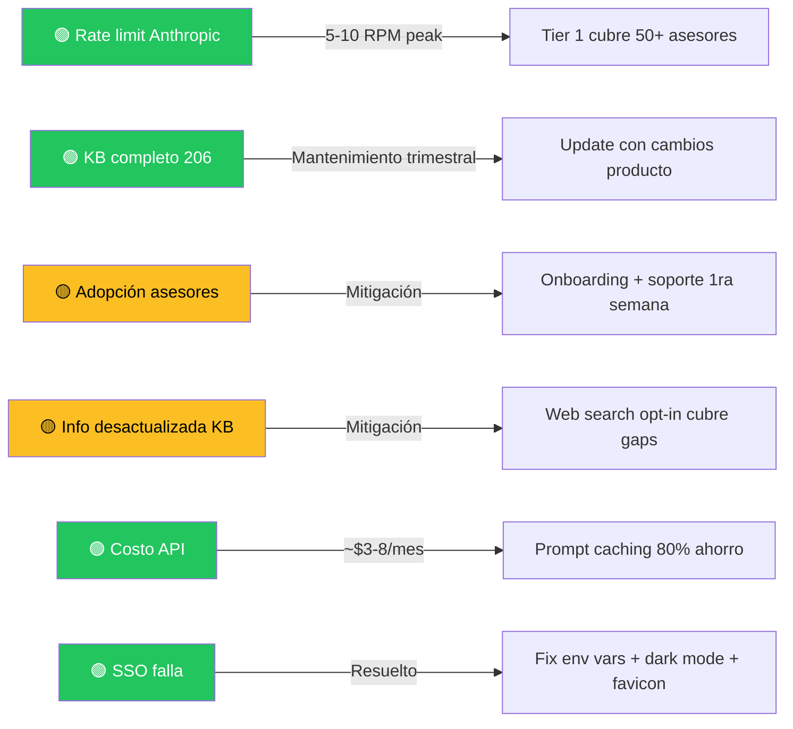

# 🗺️ Roadmap Visual — WINDMAR AI AGENT

> Mapa conceptual del proyecto. **Última actualización: 8 mayo 2026**
> Estado: **🟢 EN PRODUCCIÓN — Uso definitivo activo**

---

## 🌟 Vista General

```mermaid
flowchart TD
    Root[🌟 WINDMAR AI AGENT]
    Root --> Done[✅ COMPLETADO]
    Root --> Now[🔄 EN USO]
    Root --> Next[⏳ PRÓXIMO]

    Done --> D1[Infraestructura]
    Done --> D2[Knowledge Base]
    Done --> D3[Prompt Adaptativo]
    Done --> D4[UX/UI Premium]
    Done --> D5[SSO Microsoft]
    Done --> D6[Migración Next.js]
    Done --> D7[Claude Haiku 4.5]
    Done --> D8[Web Search opt-in]
    Done --> D9[Onboarding asesores]

    Now --> N1[Validación con asesores reales]
    Now --> N2[Recolección feedback]

    Next --> X1[📸 Vision: factura LUMA]
    Next --> X2[📊 Gráficos ROI]
    Next --> X3[🗺️ Maps + direcciones]
    Next --> X4[🔌 Integración Zoho]

    style Root fill:#1B3A5C,color:#fff
    style Done fill:#22c55e,color:#fff
    style Now fill:#fbbf24,color:#000
    style Next fill:#a78bfa,color:#fff
    style D1 fill:#dcfce7,color:#15803d
    style D2 fill:#dcfce7,color:#15803d
    style D3 fill:#dcfce7,color:#15803d
    style D4 fill:#dcfce7,color:#15803d
    style D5 fill:#dcfce7,color:#15803d
    style D6 fill:#dcfce7,color:#15803d
    style D7 fill:#dcfce7,color:#15803d
    style D8 fill:#dcfce7,color:#15803d
    style D9 fill:#dcfce7,color:#15803d
    style N1 fill:#fef3c7,color:#92400e
    style N2 fill:#fef3c7,color:#92400e
    style X1 fill:#ede9fe,color:#5b21b6
    style X2 fill:#ede9fe,color:#5b21b6
    style X3 fill:#ede9fe,color:#5b21b6
    style X4 fill:#ede9fe,color:#5b21b6
```



---

## 🚦 Estado por Bloques

```mermaid
flowchart TD
    Start([🚀 Inicio Proyecto]) --> A
    A[🟢 BLOQUE A<br/>Infraestructura<br/>✅]
    A --> B[🟢 BLOQUE B<br/>Knowledge Base<br/>✅]
    B --> C[🟢 BLOQUE C<br/>Prompt IA v2<br/>✅]
    C --> D[🟢 BLOQUE D<br/>UX/UI<br/>✅]
    D --> H[🟢 BLOQUE H<br/>Auth v1 Email/Pass<br/>✅ Reemplazado]
    H --> I[🟢 BLOQUE I<br/>Migración Next.js<br/>+ SSO Microsoft<br/>✅]
    I --> J[🟢 BLOQUE J<br/>Haiku 4.5<br/>+ Web Search<br/>✅]
    J --> K[🟢 BLOQUE K<br/>Onboarding<br/>asesores nuevos<br/>✅]
    K --> E{🟡 BLOQUE E<br/>Validación<br/>📍 AQUÍ}
    E -->|Feedback OK| F[⏳ BLOQUE F<br/>Vision + Gráficos<br/>+ Maps]
    F --> V1([🎯 v2.0 PRODUCCIÓN COMPLETA])
    V1 --> G[🔮 BLOQUE G<br/>Integraciones<br/>Zoho/Smartsheet]

    style A fill:#22c55e,color:#fff
    style B fill:#22c55e,color:#fff
    style C fill:#22c55e,color:#fff
    style D fill:#22c55e,color:#fff
    style H fill:#22c55e,color:#fff
    style I fill:#22c55e,color:#fff
    style J fill:#22c55e,color:#fff
    style K fill:#22c55e,color:#fff
    style E fill:#fbbf24,color:#000
    style F fill:#a78bfa,color:#fff
    style G fill:#a78bfa,color:#fff
    style V1 fill:#f97316,color:#fff
    style Start fill:#1B3A5C,color:#fff
```



---

## 📊 Stack Actual (Producción)



---

## 📊 Detalle por Bloque

### 🟢 BLOQUE I — Migración Next.js + SSO Microsoft ✅



### 🟢 BLOQUE J — Claude Haiku 4.5 + Web Search ✅



### 🟢 BLOQUE K — Onboarding asesores nuevos ✅



### 🟢 BLOQUE C v2 — System Prompt Refactorizado ✅



---

## 🛣️ Línea de Tiempo



---

## 🎯 Capacidades Disponibles AHORA

| Capacidad | Estado | Notas |
|---|---|---|
| 💬 Chat texto streaming | ✅ Live | Haiku 4.5 con prompt caching |
| 🔐 SSO Microsoft Entra ID | ✅ Live | NextAuth v5, JWT 8h |
| 👋 Onboarding nuevo asesor | ✅ Live | Auto-extract primer nombre |
| 🧠 Memoria conversacional | ✅ Live | Mantiene hilo dentro de sesión |
| 📚 Knowledge base oficial | ✅ Live | 206 entradas, full-text search |
| 🌐 Web search | ✅ Live | Opt-in con palabras clave |
| 🔧 Tool selection | ✅ Live | 10 cotizadores oficiales |
| 🤖 Mascot SUN BOT | ✅ Live | 6 estados animados |
| 🌙 Dark mode | ✅ Live | Default + toggle |

---

## 🎯 Próximas Capacidades (1-3 días dev cada una)

| # | Capacidad | Esfuerzo | Impacto | Caso de uso |
|---|---|---|---|---|
| 1 | 📸 **Vision** — factura LUMA | 1h | ⭐⭐⭐⭐⭐ | Asesor sube foto, bot extrae kWh + monto |
| 2 | 📊 **Gráficos ROI** | 1h | ⭐⭐⭐⭐ | PNG de proyección 25 años para mandar al cliente |
| 3 | 🗺️ **Maps/Direcciones** | 30min | ⭐⭐⭐⭐ | Link Google Maps con ruta cliente → Windmar |
| 4 | 📄 **PDF processing** | 30min | ⭐⭐⭐ | Subir contrato competencia, comparar |
| 5 | 🧠 **Memory tool** | 2h | ⭐⭐⭐ | Recuerda datos persistentes del asesor |
| 6 | 🔌 **Zoho integration** | 3h | ⭐⭐⭐ | Bot consulta CRM directo desde chat |

---

## 🚦 Semáforo de Riesgos



---

## 📅 Bitácora de Cambios

### 8 mayo 2026 — Día de lanzamiento definitivo 🎉

**Mañana — SSO Microsoft Entra ID:**
- Migración completa de React + Vite → Next.js 15.5.18 + NextAuth v5
- Reemplazado login email/password por botón único "Iniciar sesión con Microsoft"
- Restricción a dominio `@windmarhome.com` en callback `signIn`
- Sesión JWT cifrada de 8 horas (auto-logout al final del turno)
- Middleware protege todas las rutas (excepto `/login` y assets)
- Refactor DB: `user_roles` table reemplaza `auth.users.user_metadata`
- Fix env vars con valores vacíos (re-creación via REST API directa)
- Dark mode por defecto en login + script anti-flash SSR
- Favicon SUN BOT via Next.js convention `app/icon.png`
- Open Graph para preview en Teams/WhatsApp/Slack

**Tarde — Claude Haiku 4.5 + Web Search:**
- Migración endpoint `/api/chat` de Groq → Anthropic SDK
- Modelo: `claude-haiku-4-5` con prompt caching del SYSTEM_PROMPT (~80% ahorro)
- Web search opt-in: triggers "investiga", "busca online", "actualízame"
- Tool `web_search_20250305` con `max_uses: 3` por turno
- Prefijo 🌐 + cita de fuente cuando usa web search
- Manejo de errores tipados (RateLimitError, AuthenticationError, etc.)
- Fix bug perfil no guardaba: `useSession().update()` con datos directos al JWT
- Página de login en dark mode

**Tarde-Noche — Onboarding + Prompt v2:**
- Migración SQL 006: agrega columna `onboarded_at` a `user_roles`
- `OnboardingModal.tsx`: pantalla de bienvenida con SUN BOT, primer nombre auto-extracted, dropdown depto, radio cards rol con descripciones
- Auth signIn callback ahora extrae solo PRIMER nombre por defecto
- Endpoint POST `/api/profile/onboarding` marca `onboarded_at` + guarda perfil
- `OnboardingGate` envuelve ChatApp; modal solo si `onboarded_at IS NULL`
- Pantalla de éxito con saludo personalizado antes del primer chat
- **SYSTEM_PROMPT v2 con 8 fixes críticos:**
  - Identidad unificada como MENTOR (no mezcla Asistente)
  - Instrucciones explícitas para web search (cuándo, cómo citar)
  - Datos del asesor documentados → tono adaptativo según rol
  - Lenguaje menos alarmista (Haiku 4.5 sigue instrucciones literalmente)
  - Reglas de precios con balance HAZ vs EVITA
  - Memoria conversacional con pasos concretos
  - Formato Mentor adaptativo (no rígido) — solo secciones que aplican
  - Ejemplo positivo de buena respuesta Tipo 4

**Noche — Reset definitivo y comunicación:**
- Reset DB total para arranque limpio (KB intacto: 206)
- Anuncio a asesores para uso definitivo
- ROADMAP actualizado en GitHub

**Stack final en producción:**
- Frontend: Next.js 15.5.18 + React 19 + TypeScript + Tailwind v4
- Auth: NextAuth v5 + Microsoft Entra ID (claude-opus-4-7 SDK pattern)
- AI: Anthropic SDK + Claude Haiku 4.5 + prompt caching + web_search_20250305
- DB: Supabase PostgreSQL 17 + RLS + service_role key
- Hosting: Vercel (auto-deploy from GitHub `main`)
- URL: https://windmar-ai-agent.vercel.app

---

### 7 mayo 2026 — Decisión estratégica: SSO sin DNS

- Removido Resend SMTP y dependencia de DNS GoDaddy
- Decisión: SSO Microsoft es self-explanatory, no requiere welcome email
- Reset total de la DB (preparativo para rebuild)
- Plan de migración a Next.js + NextAuth definido

### 4 mayo 2026 — Email profesional con Resend (luego removido)

Email profesional via Resend SMTP configurado, luego descartado el 7 mayo cuando se decidió ir directamente a SSO sin DNS.

### 1 mayo 2026 — Roles ampliados + Anti-alucinación

- Agregado rol Project M (jefe de líderes)
- 4 niveles de tono: Asesor / Líder / Channel / Project M
- Reglas anti-alucinación REGLA #0/1/2 (luego refinadas en v2 del prompt)
- Chat estilo ChatGPT (sin burbujas IA)

### 30 abril 2026 — Auth v1 (luego reemplazado por SSO)

Sistema de login email/password con flip card 3D, registro con depto/rol/T&C, ProfileModal. Reemplazado completamente el 8 mayo por SSO Microsoft.

---

## 🔮 PENDIENTES — Roadmap futuro

### 🟠 Esta semana (validación post-lanzamiento)
| # | Tarea | Tiempo |
|---|---|---|
| 1 | Asesores prueban en uso real | 5-7 días |
| 2 | Recolección feedback cualitativo | continua |
| 3 | Monitor logs Vercel para errores | continua |
| 4 | Métricas Anthropic (cache hit rate, RPM) | continua |

### 🟡 Próxima semana (capacidades avanzadas)
| # | Capacidad | Esfuerzo |
|---|---|---|
| 1 | 📸 Vision: subir factura LUMA | 1h dev |
| 2 | 📊 Code execution: gráficos ROI | 1h dev |
| 3 | 🗺️ Maps/direcciones via web search | 30min dev |

### 🟢 Mes próximo (integraciones)
| # | Capacidad | Esfuerzo |
|---|---|---|
| 1 | 🔌 Integración Zoho CRM | 3h dev |
| 2 | 📊 Dashboard métricas Project M | 1d dev |
| 3 | 👍👎 Sistema feedback de respuestas | 4h dev |
| 4 | 📄 PDF processing (contratos) | 30min dev |

### 🔮 Backlog (cuando haya bandwidth)
- Foto de perfil desde Microsoft Graph
- Renombrar conversaciones
- Multi-idioma (futuro lejano)
- Notificaciones push
- Reportes semanales automatizados

---

## 📍 ¿Cómo ver este mapa?

### Opción 1 — GitHub (más fácil)
1. Ya está en tu repo: `ROADMAP.md`
2. Abre el archivo en GitHub web
3. Los diagramas se renderizan **automáticamente**
4. Link directo: https://github.com/JnSbstnRivera/WINDMAR-AI-AGENT/blob/main/ROADMAP.md

### Opción 2 — Mermaid Live Editor
1. Ve a https://mermaid.live
2. Copia/pega cualquier bloque ` ```mermaid ` de este archivo
3. Lo ves en tiempo real, lo descargas como PNG/SVG

### Opción 3 — VS Code
1. Instala extensión "Markdown Preview Mermaid Support"
2. Abre `ROADMAP.md`
3. `Ctrl+Shift+V` para preview

---

**Última actualización**: 8 mayo 2026 — día de lanzamiento definitivo
**Próxima revisión sugerida**: después de 1 semana de uso real, basado en feedback de asesores
