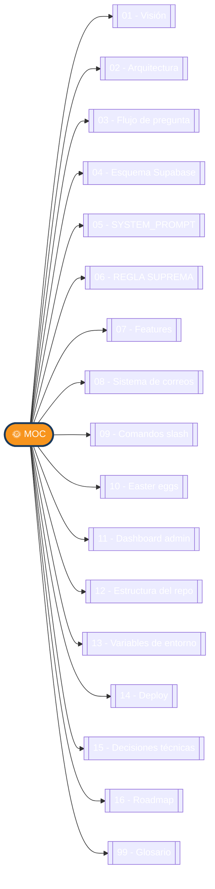

# 🌞 Windmar AI Agent — Mapa Maestro del Vault

> [!abstract] Bienvenido al vault dedicado del Sun Bot
> Aquí vive **toda la documentación** del copiloto IA del Call Center Windmar Home Puerto Rico, organizada por temas para navegación rápida en Obsidian.
> Cada nota es independiente pero está conectada con las demás vía `[[wikilinks]]`. Abre el **Graph View** (`Ctrl+G`) para ver la red completa.

> [!success] Estado · Mayo 2026
> ✅ En producción · 🌐 `windmar-ai-agent.vercel.app` · 👥 Solo `@windmarhome.com`

---

## 📑 Estructura del vault

---

## 🎯 Por tema

### Para entender el proyecto
- 🎯 [[01 - Visión y propósito|Visión y propósito]] — qué resuelve, para quién, por qué importa
- 🛣️ [[16 - Roadmap|Roadmap]] — qué viene después

### Para entender la mecánica
- 🏗️ [[02 - Arquitectura|Arquitectura]] — stack y diagrama general
- 🔁 [[03 - Flujo de pregunta|Flujo de una pregunta]] — sequence completo
- 🗄️ [[04 - Esquema Supabase|Esquema Supabase]] — tablas, relaciones, RPCs
- 📁 [[12 - Estructura del repo|Estructura del repo]] — árbol de archivos

### Para entender el comportamiento
- 🧠 [[05 - SYSTEM_PROMPT|SYSTEM_PROMPT]] — el cerebro del bot
- ⚠️ [[06 - REGLA SUPREMA|REGLA SUPREMA]] — cero precios, regla inquebrantable

### Para conocer features
- ✨ [[07 - Features|Features completas]] — lista de capacidades
- 📧 [[08 - Sistema de correos|Sistema de correos]] — Microsoft Graph + plantillas
- 🎮 [[09 - Comandos slash|Comandos slash]] — productividad
- 👾 [[10 - Easter eggs|Easter eggs y juegos]] — Snake, Pong, Invaders
- 📊 [[11 - Dashboard admin|Dashboard admin]] — métricas y auditoría

### Para operar y desplegar
- 🔧 [[13 - Variables de entorno|Variables de entorno]] — config y secretos
- 🚀 [[14 - Deploy|Deploy]] — Vercel pipeline
- 🧰 [[15 - Decisiones técnicas|Decisiones técnicas]] — por qué Claude, Supabase, etc.

### Referencia
- 📚 [[99 - Glosario|Glosario]] — términos del proyecto

---

## 🔥 Quick links

> [!info] Lo más consultado
> - El cerebro del bot: [[05 - SYSTEM_PROMPT]]
> - Por qué nunca damos precios: [[06 - REGLA SUPREMA]]
> - Cómo se envían correos: [[08 - Sistema de correos]]
> - Comandos disponibles: [[09 - Comandos slash]]

---

## 🔗 Repos relacionados (vault padre)

> [!note] Este vault es una sub-carpeta
> El vault principal (con todos los repos Windmar) está en `C:\Claude Code\repos\`. Las notas de allí enlazan a este agente vía `[[WINDMAR-AI-AGENT]]`. Repos hermanos:
> - 🔧 **PANEL-DE-HERRAMIENTAS-CALL-CENTER** — hub que invoca al agente
> - ⚡ **LUMA-SCANNER** — comparte API key de Anthropic
> - 🎙️ **WINDMAR-QA-CALLS** — análisis de llamadas grabadas

---

*Vault generado · Última actualización 2026-05-26* ☀️
