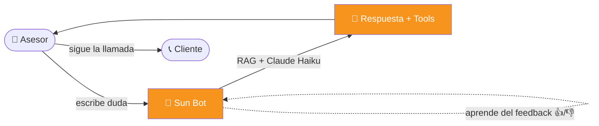

# 🎯 Visión y propósito

> [!quote] La frase que lo resume
> *"No reemplazar al asesor. Potenciarlo. Que durante cada llamada tenga al colega más experto de Windmar al lado, listo para ayudarle a cerrar."*

---

## El problema

> [!example] Un día típico en el call center
> 1. El asesor recibe una llamada
> 2. El cliente pregunta algo técnico (financiamiento, garantía, especificación)
> 3. El asesor no recuerda el dato exacto
> 4. **Pone al cliente en hold** y busca:
>    - En el manual de PDF
>    - En el chat del equipo
>    - Le pregunta al supervisor
> 5. Pasan 1-3 minutos
> 6. **El cliente pierde paciencia** o cuelga

Resultado: ventas perdidas por fricción, no por falta de conocimiento.

---

## La solución

Un **copiloto IA** que el asesor consulta durante la llamada — en silencio, sin colgar, escribiendo lo que necesita saber. Devuelve la respuesta en menos de 2 segundos.

---

## Para quién

| Rol | Cómo lo usa |
|-----|-------------|
| **Asesor** | Pregunta técnica · objeción · script · datos del cliente |
| **Líder de equipo** | Coaching socrático · revisar matriz de calidad |
| **Channel/Project M** | Procesos · datos duros · resolución de excepciones |
| **Admin/Supervisor** | Dashboard de métricas (`/admin`) |

> [!tip] Tono adaptativo
> El bot **detecta el rol** del usuario al loguearse y ajusta el tono:
> - Asesor → casual, motivador, con emojis
> - Líder → formal, estructurado
> - Channel → directo, sin adornos
>
> Ver: [[05 - SYSTEM_PROMPT#Tonos por rol]]

---

## Filosofía

> [!important] Tres principios no negociables
> 1. **Acompaña, no reemplaza.** El asesor sigue siendo el dueño de la venta.
> 2. **Responde como colega, no como manual.** Tono cálido + dato preciso.
> 3. **Cero información peligrosa.** Sin precios concretos, sin promesas de ahorro. Ver [[06 - REGLA SUPREMA]].

---

## Métricas de éxito

| KPI | Objetivo | Estado actual |
|-----|----------|---------------|
| Tiempo de respuesta | < 2s primer token | ✅ ~500ms |
| Satisfacción (👍 / total) | > 75% | ✅ 75% |
| Mensajes diarios | crecimiento mensual | 📈 |
| Cobertura del KB | > 200 entradas | ✅ 239 |
| Herramientas integradas | catálogo completo | ✅ 29 |

> [!info] Cómo se miden
> Todas las métricas se calculan en el [[11 - Dashboard admin|Dashboard admin]] vía funciones RPC de PostgreSQL.

---

## Resultado esperado

- ✅ **Menos llamadas perdidas** por información lenta
- ✅ **Más cierres en primera llamada** (no hay "te llamo después")
- ✅ **Mayor confianza del asesor** (siempre tiene una segunda opinión)
- ✅ **Coaching escalable** (no depende de un líder humano disponible)
- ✅ **Conocimiento compartido** (lo que un asesor aprende, todos lo saben)

---

## Conexiones

- 🏗️ Cómo se construyó técnicamente: [[02 - Arquitectura]]
- 🧠 Cómo se comporta: [[05 - SYSTEM_PROMPT]]
- ✨ Qué puede hacer hoy: [[07 - Features]]
- 🛣️ Hacia dónde va: [[16 - Roadmap]]

[[00 🌞 MOC|← Volver al MOC]]
