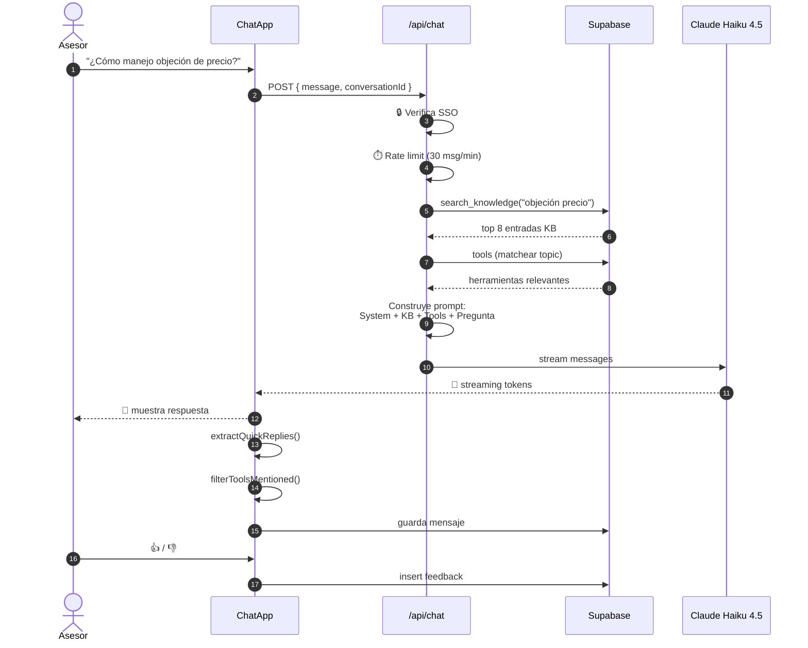

# 🔁 Flujo de una pregunta

## Sequence diagram completo



---

## Pasos detallados

### Paso 1 — Asesor escribe

El input del chat soporta:
- Texto plano
- Comandos slash (interceptados client-side — ver [[09 - Comandos slash]])
- Adjuntar archivo (PDF/imagen — ver [[07 - Features#Análisis de documentos]])

### Paso 2 — Cliente envía POST

```typescript
POST /api/chat
{
  message: "¿Cómo manejo objeción de precio?",
  conversationId: "uuid-existente-o-null",
  user: { email, displayName, departamento, rol }
}
```

### Paso 3 — Backend valida

1. **Sesión** — `auth()` debe devolver una sesión válida
2. **Dominio** — debe ser `@windmarhome.com` (se valida en NextAuth)
3. **Rate limit** — máximo 30 mensajes por minuto por asesor (memoria server)

### Paso 4 — RAG: búsqueda en knowledge base

```sql
SELECT * FROM search_knowledge(
  search_query := 'objeción precio',
  filter_categoria := NULL,
  filter_area := 'PR',
  result_limit := 8
);
```

> [!info] Cómo busca
> `search_knowledge` hace ILIKE en `titulo` y `contenido`, filtrando por `area` (PR o ALL). Devuelve hasta 8 entradas. **No es vector search** — es match de texto. Para casos complejos esto se quedará corto y migraremos a embeddings.

### Paso 5 — Matcheo de herramientas

`tools.ts` ejecuta `detectTopic(message)` que aplica patrones regex sobre el mensaje:

```typescript
const TOPIC_PATTERNS = {
  solar:    /placa|panel|solar|kwh|kilowatt/i,
  roofing:  /techo|roof|shingle|impermeabiliza/i,
  agua:     /agua|cisterna|purificador|ósmosis/i,
  bateria:  /batería|backup|inversor/i,
  financia: /loan|lease|financ|cuota|interés/i,
  // ...
};
```

Después filtra `tools` por `topic` y `active=true`.

### Paso 6 — Construcción del prompt

```
[SYSTEM_PROMPT con cache_control: ephemeral]
  ↓
[Contexto del asesor: rol, departamento, displayName]
  ↓
[KNOWLEDGE BASE: top 8 entradas relevantes]
  ↓
[HERRAMIENTAS DISPONIBLES: top 5 por topic]
  ↓
[Historial: últimos N mensajes de la conversación]
  ↓
[Mensaje actual del asesor]
```

### Paso 7 — Stream desde Claude

```typescript
const stream = await anthropic.messages.create({
  model: 'claude-haiku-4-5',
  max_tokens: 1500,
  stream: true,
  system: [
    { type: 'text', text: SYSTEM_PROMPT, cache_control: { type: 'ephemeral' } }
  ],
  messages: [...historial, { role: 'user', content: enrichedMessage }]
});
```

### Paso 8 — Streaming al cliente

Server-Sent Events (SSE) hacen llegar cada delta de texto al cliente conforme Claude lo genera. El usuario ve la respuesta "escribirse" como con typewriter.

### Paso 9 — Post-procesamiento client-side

Después de que termina el stream:
1. **`extractQuickReplies(text)`** — extrae chips de respuesta rápida del bloque `<quick_replies>`
2. **`filterToolsMentionedInText(tools, text)`** — solo muestra tarjetas de herramientas que el LLM realmente mencionó como markdown link
3. **Guarda en DB** — POST a `/api/messages` para persistir

### Paso 10 — Feedback opcional

El asesor puede votar 👍 o 👎. El 👎 abre input para razón.

```typescript
POST /api/feedback
{
  conversation_id,
  message_content,
  rating: 'down',
  reason: 'No respondió la pregunta'
}
```

Esto se ve en el [[11 - Dashboard admin]] para mejorar el bot.

---

## Latencia objetivo

| Paso | Tiempo |
|------|--------|
| 1-3 (validación) | ~50ms |
| 4 (RAG) | ~80ms |
| 5 (tools match) | ~5ms |
| 6 (build prompt) | ~10ms |
| 7 → primer token | **~500ms** ⭐ |
| Stream completo | ~2-5s según largo |

> [!tip] El número que importa
> **TTFT** (Time To First Token) — qué tan rápido aparece el primer carácter. Si está bajo 1s, se siente instantáneo.

---

## Conexiones

- 🏗️ Arquitectura general: [[02 - Arquitectura]]
- 🗄️ Tablas que se consultan: [[04 - Esquema Supabase]]
- 🧠 Qué le pasamos al LLM: [[05 - SYSTEM_PROMPT]]

[[00 🌞 MOC|← Volver al MOC]]
