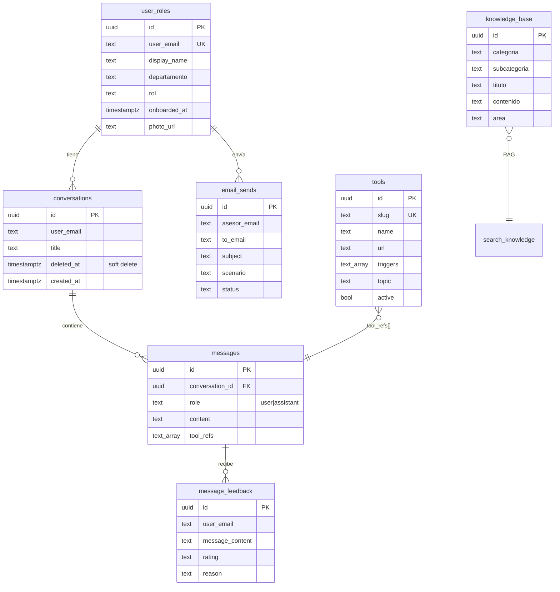

# 🗄️ Esquema de Supabase

## Diagrama ER



---

## Tablas en detalle

### 📚 `knowledge_base` — el conocimiento del bot

La tabla **más importante** del proyecto. Cada fila es un pedazo de conocimiento que el bot puede usar.

| Columna | Tipo | Qué es |
|---------|------|--------|
| `categoria` | text | `PRODUCTO_SOLAR`, `FINANCIAMIENTO`, `OBJECION`, `PROCESO`, etc. |
| `subcategoria` | text | Sub-agrupación opcional |
| `titulo` | text | Título corto descriptivo |
| `contenido` | text | El conocimiento en sí — texto plano o markdown ligero |
| `area` | text | `'ALL'` (cualquier área) o `'PR'` (solo Puerto Rico) |

**Ejemplo de fila:**
```
categoria:    OBJECION_ARGUMENTO
subcategoria: PRECIO
titulo:       Cliente dice "está muy caro"
contenido:    Validar la percepción primero. Preguntar:
              "¿Comparado con qué?". Si es vs LUMA actual, hacer
              cálculo con su factura. Si es vs competencia,
              destacar garantía 25 años + servicio post-venta...
area:         ALL
```

### 🛠️ `tools` — herramientas que el bot recomienda

| Columna | Tipo | Qué es |
|---------|------|--------|
| `slug` | text UK | ID único (`cotizador-loan`) |
| `name` | text | Nombre visible |
| `url` | text | Link absoluto |
| `description` | text | Una línea para la tarjeta |
| `when_to_use` | text | Cuándo recomendarla (va al prompt) |
| `triggers` | text[] | Palabras clave |
| `topic` | text | `solar`, `roofing`, `agua`, etc. |
| `icon` | text | Emoji |
| `recommend` | bool | Si el LLM la sugiere |
| `active` | bool | Si está en el catálogo |

### 💬 `conversations` y `messages`

Hilos de chat con soft delete (no se borran, solo marcan `deleted_at`).

### 👤 `user_roles` — perfiles

Auto-provisionados en el primer login con `display_name = primer nombre del SSO`. El asesor puede personalizar después.

### 👍 `message_feedback` — votos

| `rating` | Significado |
|----------|-------------|
| `up` | El asesor le dio 👍 |
| `down` | El asesor le dio 👎 (con `reason` opcional) |

### 📧 `email_sends` — auditoría de correos

Cada correo enviado vía Microsoft Graph queda registrado para auditoría.

---

## Funciones RPC (PostgreSQL plpgsql)

### `search_knowledge(query, categoria, area, limit)`

Búsqueda full-text para el RAG.

```sql
SELECT * FROM search_knowledge(
  search_query := 'objeción precio',
  filter_categoria := NULL,
  filter_area := 'PR',
  result_limit := 8
);
```

### Funciones del dashboard

| Función | Devuelve |
|---------|----------|
| `admin_metrics_kpis(period)` | Total mensajes, asesores activos, satisfacción% |
| `admin_usage_by_day(period)` | Serie temporal de mensajes |
| `admin_top_asesores(period, max_rows)` | Ranking de asesores |
| `admin_recent_downvotes(period, max_rows)` | Mensajes con 👎 |
| `admin_recent_conversations(period, max_rows)` | Auditoría completa |
| `admin_messages_by_dept(period)` | Uso por departamento |
| `admin_usage_by_hour(period)` | Hora pico |

> [!tip] El filtro `period`
> Todas las funciones de admin aceptan `'today' | 'week' | 'month' | 'all'`. La función `admin_period_start(period)` centraliza el cálculo del timestamp inicial.

> [!info] Vista `all` con solo meses activos
> `admin_usage_by_day('all')` agrupa directamente desde `messages` con `GROUP BY date_trunc('month', ...)`. Antes generaba 12 meses fijos y mostraba 11 en cero (porque el bot arrancó hace pocos meses).

---

## Migraciones

El directorio `supabase/migrations/` tiene SQL versionado:

| # | Qué hace |
|---|----------|
| `006` | Crea `tools` + 29 seeds + `messages.tool_refs` |
| `007` | Matriz de calidad + triggers de enseres |
| `008` | Filtro de periodo aplica a TODO el dashboard |
| `009` | `admin_usage_by_day` agrupa por mes cuando `all` |
| `010` | Solo meses activos en vista `all` |

---

## Conexiones

- 🔁 Cómo se consultan estas tablas: [[03 - Flujo de pregunta]]
- 📊 Cómo se visualizan estos datos: [[11 - Dashboard admin]]

[[00 🌞 MOC|← Volver al MOC]]
