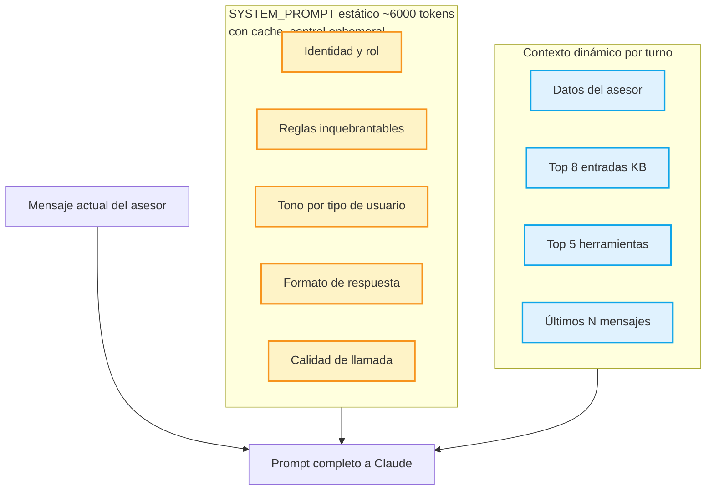

# 🧠 SYSTEM_PROMPT — El cerebro del bot

> [!warning] El archivo más crítico del proyecto
> `src/lib/prompts.ts` (~480 líneas) define **cómo se comporta** el bot en cada respuesta. Cambios acá afectan TODAS las interacciones.

---

## Estructura del prompt



---

## Secciones del SYSTEM_PROMPT

### 1. Identidad

> Eres Sun Bot, el copiloto IA del Call Center Windmar Home Puerto Rico.
> Trabajas en tiempo real con asesores durante sus llamadas con clientes.
> Llevamos 22 años iluminando hogares.

### 2. **REGLA SUPREMA**

Ver: [[06 - REGLA SUPREMA]]

> [!danger] La regla más importante
> Sin esta sección, el bot podría dar precios → problema legal/comercial.

### 3. Tonos por rol

Detecta el `rol` del usuario y ajusta el tono:

| Rol | Tono |
|-----|------|
| `Asesor` | Casual, motivador, con emojis ☀️💪🎯 |
| `Líder` | Formal, estructurado, datos primero |
| `Channel` | Directo, sin adornos, comando-respuesta |
| `Project M` | Procesos y excepciones, lenguaje operativo |

### 4. Formato de respuesta

> [!info] Reglas de formato
> - Markdown ligero (bold, listas)
> - NO usar headers H1/H2/H3 dentro de la respuesta
> - Links a herramientas en formato `[Nombre](url)` para que el filtro client-side los detecte
> - Si hay tabla, máximo 4 columnas (legibilidad en sidebar)
> - Quick replies en bloque `<quick_replies>...</quick_replies>` al final

### 5. Word caps por tipo de pregunta

Para evitar respuestas demasiado largas (el asesor está en llamada):

| Tipo de pregunta | Cap de palabras |
|------------------|-----------------|
| Despedida (gracias, ok, adiós) | 35 |
| Duda rápida | 110 |
| Seguimiento de tema | 90 |
| Pregunta compleja | 280 |
| Análisis profundo | 450 |

### 6. Modo Socrático

Si el asesor dice "tengo duda", "no sé qué decir", "se me trabó" → el bot NO da una solución directa. En su lugar:

> "Antes de darte mi mejor recomendación, dame 2-3 datos del cliente: ..."

Esto implementa **SPIN selling**:
- **S**ituation — datos básicos
- **P**roblem — qué le duele al cliente
- **I**mplication — qué pasa si no actúa
- **N**eed-payoff — qué gana si actúa

### 7. Calidad de llamada

Reglas según departamento (Telemercadeo, VASS, etc.) con tiempos máximos por sección de la matriz Excel oficial.

### 8. Quick Replies

Reglas críticas (aprendidas tras 2 bugs):

> [!warning] Los chips son lo que el ASESOR diría AL bot
> NO son preguntas que el bot le hace al cliente. Cuando bot pregunta "¿cuánto paga el cliente?", los chips son afirmaciones tipo:
> - "Cliente paga ~$200/mes"
> - "Cliente paga ~$350/mes"
> - "No sé, pídele factura"
>
> Si el chip es la misma pregunta → loop infinito.

---

## Inyección dinámica

### Knowledge base
```
═══ CONOCIMIENTO RELEVANTE ═══
[Categoria]: [titulo]
[contenido]

[siguiente entrada...]
═════════════════════════════
```

Las top 8 entradas se inyectan como contexto adicional. El bot decide cuáles usar.

### Herramientas
```
═══ HERRAMIENTAS DISPONIBLES ═══
[icon] [name] — [description]
  Usar cuando: [when_to_use]
  Link: [url]

[siguiente herramienta...]
══════════════════════════════
```

El bot las menciona como markdown links — el filtro client-side detecta cuáles aparecen en el output y solo muestra esas tarjetas.

---

## Anti-patrones que evitamos

> [!danger] El bot NUNCA hace
> - Decir "como modelo de lenguaje..." (rompe la ilusión de colega)
> - Dar disculpas excesivas ("perdón por la confusión...")
> - Repetir la pregunta del asesor antes de responder
> - Usar `---` o headers grandes (rompe el flow del chat)
> - Inventar datos que no están en el KB
> - Dar precios concretos (REGLA SUPREMA)

---

## Conexiones

- ⚠️ La regla suprema: [[06 - REGLA SUPREMA]]
- 🔁 Cuándo se construye este prompt: [[03 - Flujo de pregunta#Paso 6 — Construcción del prompt]]
- ✨ Cómo se manifiestan estas reglas en features: [[07 - Features]]

[[00 🌞 MOC|← Volver al MOC]]
