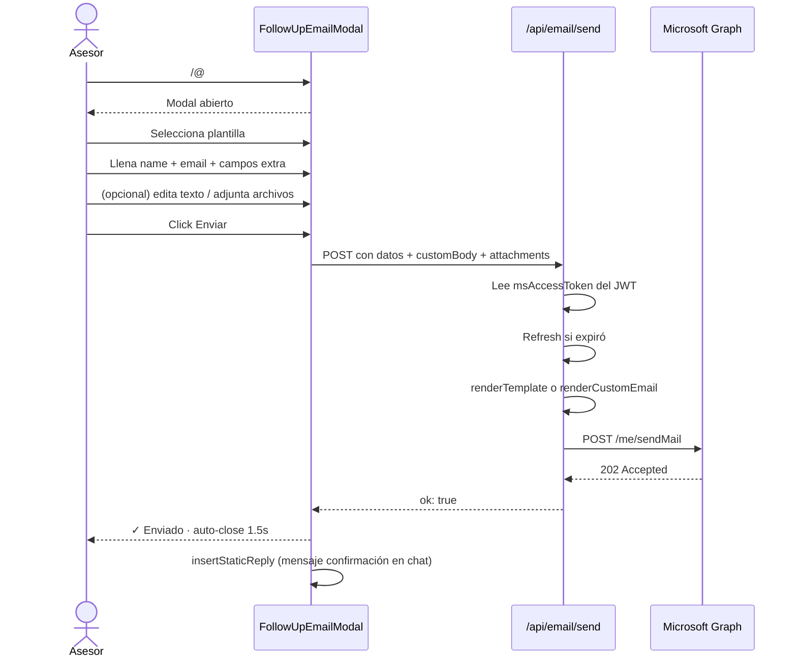

# 📧 Sistema de correos de seguimiento

> [!info] Microsoft Graph directo
> El asesor envía correos personalizados al cliente **desde su propio Outlook** (no desde una cuenta genérica). Usa el `access_token` del SSO con scope `Mail.Send`.

---

## Cómo se invoca

Comandos slash equivalentes (todos abren el mismo modal):

| Comando | Notas |
|---------|-------|
| `/@` | ⚡ Atajo rápido (símbolo universal de correo) |
| `/seguimiento` | Descriptivo |
| `/correos` | Plural |
| `/correo` · `/email` · `/followup` | Aliases extra |

Ver: [[09 - Comandos slash]]

---

## Las 6 plantillas

| Icono | Plantilla | Cuándo usarla | Campos extra |
|-------|-----------|---------------|--------------|
| 💬 | **Seguimiento general** | Cliente con quien ya conversaste | — |
| 📄 | **Pedir documentos** | Necesitas docs para propuesta | Textarea (qué pedir) |
| 📞 | **No contestó la llamada** | Intentaste llamar — sin respuesta | — |
| 📅 | **Confirmar cita técnica** | Confirmar visita programada | Fecha + Hora + Consultor |
| ✈️ | **Enviar documento** | Adjuntar cotización/contrato | Nombre del documento |
| ✨ | **Bienvenida** | Cliente nuevo — onboarding | Producto + Consultor |

> [!info] Todas las plantillas
> - Respetan la [[06 - REGLA SUPREMA]] (cero precios)
> - Tono "formal pero cálido"
> - Firma corporativa Windmar automática
> - Soporte de placeholders `{{name}}`, `{{date}}`, etc.

---

## Capacidades del modal

### Selector dropdown
- Transparente con backdrop-blur
- Iconos vector estilo Lucide (no emojis bruscos)
- Hover state + check al seleccionar

### Layout horizontal
- Formulario izquierda (320px fijo)
- Preview/editor derecha (elástico, ~660px)
- Responsive: en móvil vuelve a columna única

### Firma corporativa
```
┌─────────────────────────────┐
│ [Logo Windmar Home GIF]     │
│                             │
│ Juan Rivera          ← nombre formal del SSO
│ Asesor de soluciones       │
│ Windmar Group               │
│ juan.s@windmarhome.com      │
│ 787-395-7766 Ext. 454       │
└─────────────────────────────┘
```

- **Logo**: GIF animado en `public/email-assets/windmar-logo.gif`
- **Nombre formal**: extraído del SSO ("Juan Rivera" aunque display_name sea "Juanse")
- **Cargo**: "Asesor de soluciones" (fijo)
- **Correo**: del SSO (clickeable mailto)
- **Teléfono**: corporativo fijo + **extensión editable** por asesor (localStorage)

### Editar texto

Para clientes especiales, el asesor puede editar libremente el asunto + cuerpo:
- Botón **✏️ Editar texto** convierte preview en editor
- Asunto: input
- Cuerpo: textarea con texto plano (firma se mantiene automática)
- **Restaurar plantilla** descarta cambios
- Al cambiar de plantilla, se resetea la edición

### Adjuntos

- PDF, JPG, PNG
- Máximo 3MB por archivo, 4MB total
- Lista de archivos adjuntos con [✕] para quitar
- Validación cliente + servidor

---

## Flujo técnico



---

## Endpoint `/api/email/send`

### Request

```typescript
POST /api/email/send
{
  to: string,              // correo del cliente
  name: string,            // nombre del cliente
  templateId: string,      // 'general' | 'documents' | ...
  extras?: object,         // campos extra de la plantilla
  asesorExt?: string,      // extensión telefónica (opcional)
  customBody?: string,     // si el asesor editó el texto
  customSubject?: string,  // asunto editado
  attachments?: Array<{
    name: string,
    contentType: string,
    contentBytes: string   // base64 sin prefix data:
  }>
}
```

### Response

```typescript
// Éxito
{ ok: true, message: "Correo enviado a María (maria@...)", template: "Seguimiento general" }

// Errores comunes
{ error: "Falta permiso de correo...", needsRelogin: true }  // 403
{ error: "Tu sesión expiró...", needsRelogin: true }          // 401
{ error: "El archivo X excede 3MB" }                          // 400
```

---

## Setup requerido

> [!warning] Scope Mail.Send
> En `src/auth.ts` el scope debe incluir `Mail.Send`:
> ```typescript
> scope: 'openid profile email offline_access User.Read Mail.Send'
> ```
> La primera vez que un asesor entra, ve un popup de consent: *"WINDMAR-AI-AGENT quiere enviar correo electrónico como tú"*. Click Accept y queda aprobado para siempre.

> [!info] No necesita IT
> Mail.Send es un permiso **user-consentable**. Cada asesor lo aprueba por sí mismo. No requiere admin consent en el tenant de Windmar.

---

## Conexiones

- 🧠 Por qué nunca menciona precios: [[06 - REGLA SUPREMA]]
- 🎮 Atajos para invocar el modal: [[09 - Comandos slash]]
- 🔧 Variables de entorno necesarias: [[13 - Variables de entorno]]

[[00 🌞 MOC|← Volver al MOC]]
