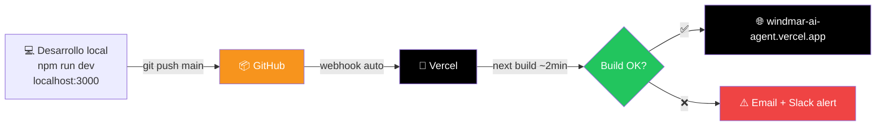

# 🚀 Deploy

## Pipeline



---

## Setup inicial (one-time)

### 1. Conectar repo a Vercel
1. Vercel Dashboard → New Project
2. Import desde GitHub: `JnSbstnRivera/WINDMAR-AI-AGENT`
3. Framework preset: Next.js (auto-detectado)
4. Branch de producción: `main`

### 2. Variables de entorno
Settings → Environment Variables → agrega todas las de [[13 - Variables de entorno]]

### 3. Custom domain (opcional)
Settings → Domains → `chat.windmar.com` (si IT lo configura DNS)

---

## Comandos locales

```bash
# Desarrollo
npm install
npm run dev               # http://localhost:3000

# Build de producción local
npm run build
npm start

# Type checking
npx tsc --noEmit
```

---

## Cada push a `main`

1. **Webhook GitHub** → notifica Vercel
2. **Vercel inicia build:**
   ```
   - npm install (cache si no cambió package.json)
   - next build
     - Type check
     - Compila TypeScript
     - Genera páginas estáticas
     - Optimiza imágenes
     - Bundle splitting
   ```
3. **Si pasa el build:** zero-downtime deploy
4. **Si falla:** se queda el deploy anterior, se notifica el error

> [!tip] Build típico
> 2-3 minutos para builds en frío. 30-60s para builds con cache.

---

## Variables de Vercel auto-inyectadas

| Variable | Disponible | Qué es |
|----------|------------|--------|
| `VERCEL_URL` | server + edge | URL del deploy actual (cambia en preview) |
| `VERCEL_ENV` | todo | `production` / `preview` / `development` |
| `VERCEL_GIT_COMMIT_SHA` | todo | SHA del commit deployado |
| `VERCEL_REGION` | todo | Región del edge function |

Útil para logs, debugging y notificaciones.

---

## Logs y debugging

### Logs en vivo
Vercel Dashboard → Project → Logs → Real-time

### Filtros útiles
- Por endpoint: `/api/chat`
- Por status: `5xx`
- Por usuario: searching email en logs

### Errores comunes

| Error | Causa | Fix |
|-------|-------|-----|
| `AADSTS50011` | Redirect URI no registrada | Agregar URL al App Registration en Azure |
| `REQUEST_HEADER_TOO_LARGE` | Cookie JWT > 4KB | No guardar fotos base64 en JWT |
| `Mail.Send 403` | Asesor no aprobó consent | Hacer logout/login |
| `Anthropic 529` | Overload de Claude | Retry con exponential backoff |
| `Supabase timeout` | Query lenta sin index | Agregar index o paginar |

---

## Rollback

```bash
# Si un deploy rompe producción:
# Opción A: revert en GitHub
git revert HEAD
git push origin main

# Opción B: promote un deploy anterior en Vercel UI
# Dashboard → Deployments → click en uno anterior → "Promote to Production"
```

> [!tip] Promote es instantáneo
> No re-buildea, solo cambia el alias. < 5 segundos.

---

## Performance en producción

| Métrica | Objetivo | Cómo se mide |
|---------|----------|--------------|
| **TTFB** | < 200ms | Vercel Analytics |
| **LCP** | < 2.5s | Vercel Speed Insights |
| **FID** | < 100ms | Vercel Speed Insights |
| **CLS** | < 0.1 | Vercel Speed Insights |
| Streaming TTFT (chat) | < 1s | Logs custom |

---

## Cron jobs (futuro)

Aún no implementado, pero pendiente:
- Limpiar conversaciones soft-deleted > 90 días
- Enviar reporte semanal de métricas por correo a admins

Se haría con Vercel Cron + un endpoint `/api/cron/cleanup`.

---

## Monitoring externo (opcional)

Sugerido para producción seria:
- **Sentry** — exception tracking
- **Vercel Analytics** — Web Vitals (ya activado)
- **Better Uptime** — uptime checks externos
- **Slack webhook** — alertas en canal de equipo

---

## Conexiones

- 🔧 Variables que se necesitan: [[13 - Variables de entorno]]
- 🏗️ Stack que se despliega: [[02 - Arquitectura]]

[[00 🌞 MOC|← Volver al MOC]]
